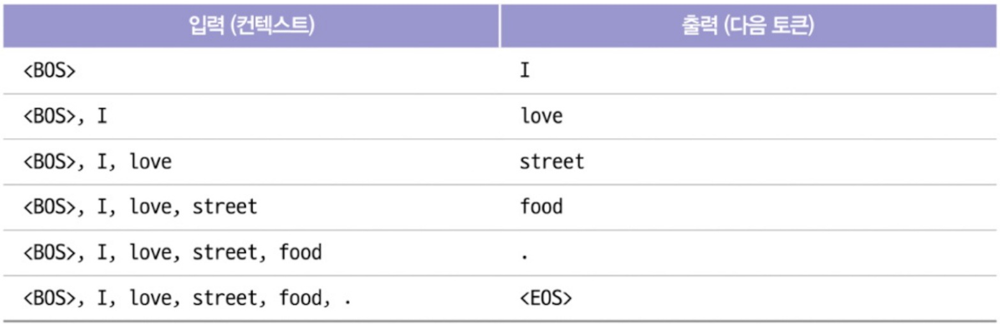
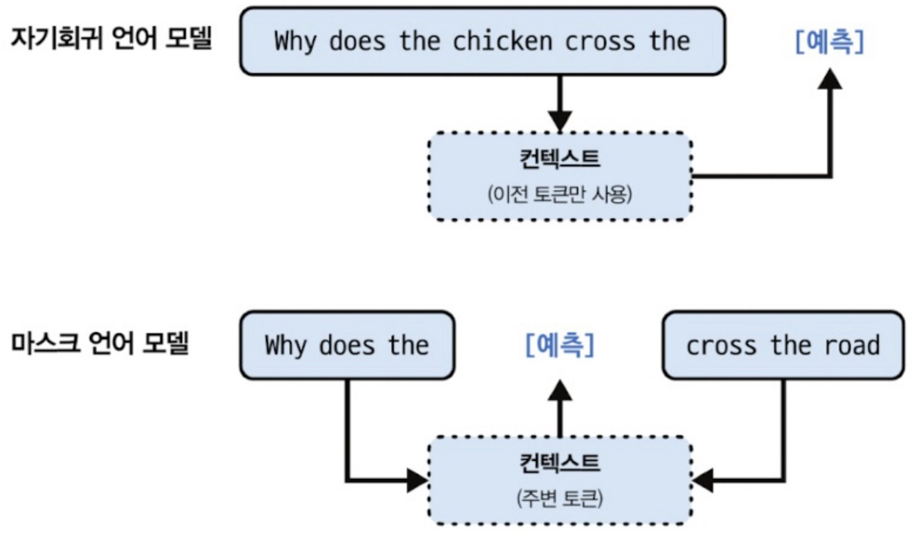
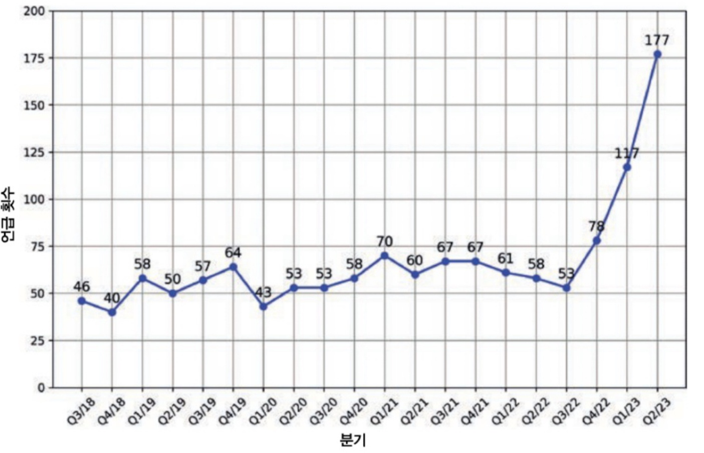
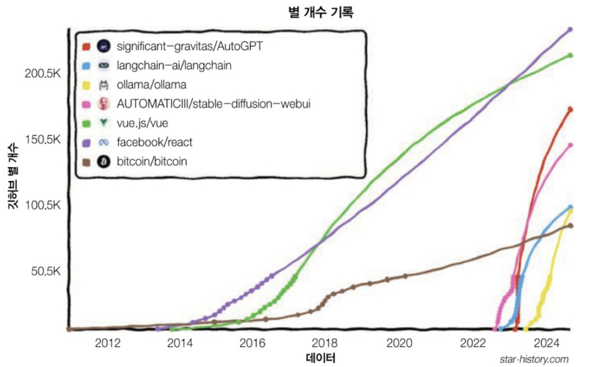
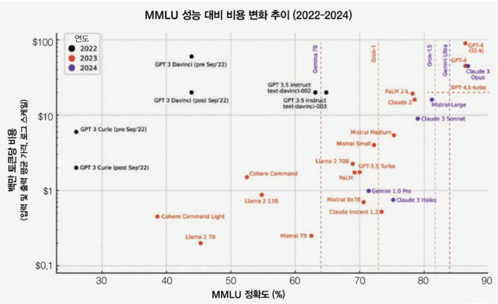
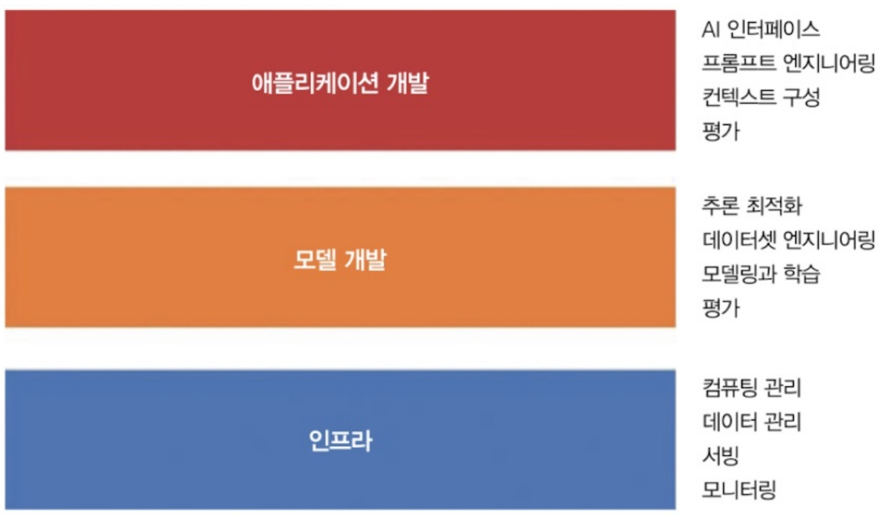
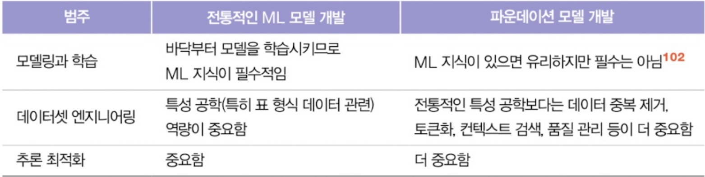
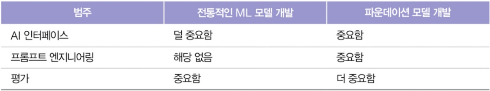
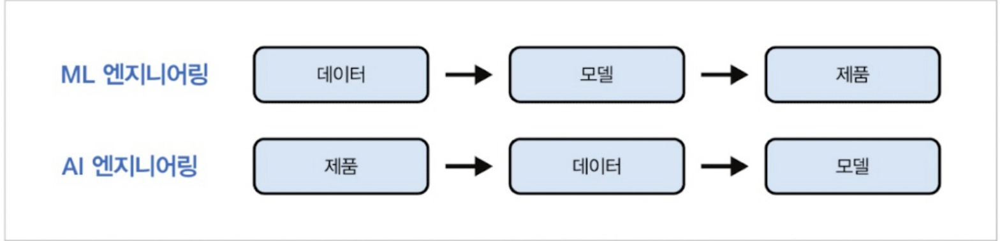

# 1장. 파운데이션 모델을 활용한 AI 애플리케이션 입문

날짜: 2025년 11월 20일
담당자: 김성언
진행 상태: In Progress

### 목차

# 1장. 파운데이션 모델을 활용한 AI 애플리케이션 입문

## 0. AI 모델의 규모가 커지면서 나타난 2가지 현상

### 1) 새로운 능력

- AI 모델이 더욱 강력해지고 더 많은 작업을 수행
- 단순히, 정확도가 좋아졌다는 것이 아닌 범용성(generality) 향상
- 과거엔 태스크마다 **별도의 모델을 훈련**해야 했지만 이제는 **한 모델이 수십 개 이상의 태스크를 처리**함.

### **2) Model-as-a-Service(MaaS)의 등장**

- 소수의 기업만 감당 가능한 LLM 학습을 위한 데이터, 컴퓨팅 자원, 전문 인력 → MaaS의 등장
- 소수의 거대조직이 개발한 모델을 다른 사람들이 서비스로 이용

<aside>

**AI 애플리케이션에 대한 수요는 증가한 반면 AI 애플리케이션을 만드는 진입 장벽은 낮아졌다**

</aside>

## **1.1 AI 엔지니어링의 부상**

### **1.1.1 언어 모델에서 대규모 언어 모델로**

 **자기지도 학습(self-supervised learning)** 덕분에 **대규모 언어 모델**(LLM)이 성장할 수 있었다

### **1) 자기 지도**

- **자기 지도학습**은 명시적인 레이블 없이 **모델이 입력 데이터(컨텍스트)를 통해 레이블을 추론**하는 방식
- 모델은 주어진 텍스트에서 **어떤 단어가 다음에 올지 예측하는 방식**으로 학습
    
    ex) "내가 가장 좋아하는 색상은 ___"에서 빈칸에 들어갈 단어를 예측
    
    → 대규모 데이터셋을 라벨링 없이 사용
    → **모델의 크기와 데이터의 양이 성능을 크게 향상**
    
    ex) "I Love Street Food"에서 ‘I’, ‘love’, ‘street’, ‘food’를 하나씩 예측하며 학습
    

표 1-1 ‘I love street food’라는 문장으로 언어 모델을 학습하기 위한 학습 샘플

<aside>

\<BOS\>: Begin of sentence, \<EOS\>: End of sentence

자기 지도 학습: 입력 데이터에서 레이블을 추론 VS 비지도 학습: 레이블 X

</aside>

### **2) 언어 모델**

- 언어 모델은 **하나 이상의 언어에 대한 통계적 패턴을 인코딩**하여 주어진 컨텍스트에서 다음에 올 단어를 예측
    
    ex) “내가 가장 좋아하는 색상은 ___”에서 ‘자동차’보다 '파란'을 적절하게 예측
    
- **역사적 배경**: 1905년 셜록 홈즈의 막대 모양 그림 해독, 2차 세계대전 클로드 섀년의 적의 메시지 해독

### **3) 토큰화 및 어휘**

- **토큰화**(tokenization)란 텍스트를 더 작은 단위인 **토큰**으로 쪼개는 과정
- 각 모델은 어**휘(vocabulary)**라고 불리는 자신만의 고유한 단어 집합을 가지고 있으며 토큰화 과정에서 이 어휘를 사용한다.
- **어휘 크기**는 모델 성능과 계산 효율에 영향을 미치며, 과거 모델들보다 **최근의 대형 모델들은 훨씬 더 많은 토큰을 다룰 수 있다.**

[OpenAI Platform](https://platform.openai.com/tokenizer)

<aside>

Q. 언어 모델은 왜 단어나 문장이 아닌 토큰을 사용할까?

A1. 문자에 비해 토큰은 단어를 의미 있는 구성 요소로 나눌 수 있다 ex) 요리하기 → 요리 + 하기
A2. 고유한 토큰의 수가 고유한 단어의 수보다 적기 때문에 모델의 어휘 크기가 줄어든다(더 효율적)
A3. 토큰은 모델이 알려지지 않은 단어를 처리할 때도 도움을 준다 ex) chatgpting → chatgpt + -ing

</aside>

### **4) 언어 모델의 두 가지 유형**

1. **마스크 언어 모델 (Masked Language Model)**
    - 입력 문장에서 일부 단어를 [MASK]로 가리고, 양방향 문맥을 통해 가려진 단어를 예측하는 방식 **(빈칸 채우기)**
    - **예시**: “내가 가장 좋아하는 [MASK]는 파란색이다.”
    - **특징**: 양방향 문맥을 사용해 문장의 이해를 돕는 데 유리
2. **자기회귀 언어 모델 (Autoregressive LM)**
    - **이전 토큰들만 보고 시퀀스의 다음 토큰을 예측하도록 학습**
    - 순차적으로 하나씩 단어를 예측하는 방식 / 예측된 단어는 다시 입력으로 들어가며 문장을 이어나감
    - **예시**: “내가 가장 좋아하는 색상은 ___” → 첫 번째 단어를 예측하고, 그 예측된 단어를 다시 사용해 문장을 이어나감

그림 1-2 자기회귀 언어 모델과 마스크 언어 모델

### **5) 대규모 모델의 정의**

- 얼마나 커야 대규모 모델로 간주할  수 있을까? 오늘의 대규모가 내일은 아주 작게 여겨질 수 있다.
- 시기별 대규모로 여겨진 모델들
    - 2018년 6월: GPT 1억 1,700만 개 파라미터
    - 2019년 2월 오픈 AI의 GPT-2 15억 개 파라미터 (기존 GPT는 소규모)
    - 2024년 12월: 1,000억 개의 파라미터 (100B)

### **1.1.2 대규모 언어 모델에서 파운데이션 모델로**

### **1) 글자 이상의 데이터 처리 능력**

- **GPT-4V**와 같은 최신 모델에서는 **이미지**와 같은 비텍스트 데이터를 처리할 수 있는 능력이 추가됐다.(추가적인 모달리티를 LLM의 통합)

### **2) 파운데이션 모델 (Foundation Models)**

- 언어 모델은 글자에만 국한되어 있다. ↔ 파운데이션 모델은 글자 이상의 처리 능력(멀티 모달리티; 둘 이상의 데이터를 처리할 수 있는 능력)를 갖는다. ex) GPT-4V, Gemini
- **파운데이션 모델**은 하나의 모델이 **다양한 작업을 처리**할 수 있도록 학습된 **범용 모델**
    - ex) 텍스트 생성, 번역, 감정 분석, 이미지 이해 등 다양한 태스크를 처리 / cf) AI 생성 텍스트 판별

<aside>

책에서 ‘파운데이션 모델’: ‘대규모 언어 모델’과 ‘대규모 멀티모달 모델’을 모두 지칭

</aside>

- 멀티 모달에서도 효과적인 자기 지도 학습
    - 오픈 AI는 ‘자연어 지도(Natural Language Supervision)’이라는 자기 지도의 변형을 사용해 언어-이미지 임베딩 모델 CLIP을 학습
        
        → 인터넷에서 함께 발견되는 (이미지, 텍스트)쌍을 수집
        

### **3) 파운데이션 모델의 성능 개선 방안**

1. **프롬프트 엔지니어링**
2. **RAG (Retrieval-Augmented Generation)**
3. **파인튜닝(Fine-tuning)**

### **1.1.3 파운데이션 모델에서 AI 엔지니어링으로**

### **1) AI 엔지니어링 정의**

- **AI 엔지니어링**은 **파운데이션 모델을 기반으로 실제 애플리케이션을 설계하고 구축**하는 과정(애플리케이션 개발, **모델의 조정 및 평가**가 핵심) ↔ ML 엔지니어링, MLOps

### **2) AI 엔지니어링의 빠른 성장 요인**

- **범용 AI 능력**: GPT, Claude 등은 다양한 분야에서 사용 가능한 범용 AI 모델을 제공함.
- **AI 투자 증가**: 많은 기업들이 AI 기술에 투자하고 있으며 그로 인해 **AI 관련 제품과 서비스가 빠르게 성장**
- **낮아진 진입 장벽**: **MaaS**(Model-as-a-Service) 덕분에 많은 기업들이 AI 애플리케이션을 쉽게 개발

S&P 500 기업 중 2023년 실적 발표에서 AI를 언급한 회사

그림 1-6 빠르게 성장 중인 ‘오픈 소스 AI 엔지니어링 도구’

## **1.2 파운데이션 모델 활용 사례**

**생성형 AI**는 주로 **사내 애플리케이션**에서 **내부용 배포**로 많이 활용되고 있다

이러한 활용은 **데이터 프라이버시**, **규정 준수**, **치명적 실패**와 같은 위험을 최소화 + AI 기술을 통합하려는 기업들의 수요를 충족

그림 1-8 내부용 애플리케이션을 배포하려는 기업이 더 많다.

<aside>

개인적인 생각: 
내부 배포와 폐쇄망 환경을 통해 모델 파인튜닝을 진행하거나 하드웨어를 판매하는 비즈니스 모델을 함께 활용하는 것이 수익화에 좀 더 유리할 것 같다.

</aside>

### **1.2.1 코딩**

AI 모델은 **코드 자동 완성**, **오류 탐지**, **디버깅**

**Claude Code, Codex**와 같은 도구들은 **개발자가 코드를 빠르게 작성할 수 있도록 도와주며** 반복적인 작업을 줄이는 데 유용

### **1.2.2 이미지 및 동영상 제작**

AI는 **텍스트 기반 이미지 생성** 및 **동영상 자동 편집**에 활용

**DALL·E**와 같은 모델은 **사용자가 제공한 텍스트 설명을 바탕으로 고해상도 이미지를 생성 + 영상 편집**

### **1.2.3 글쓰기**

AI는 **보고서 작성**, **블로그 포스트**, **광고 문구** 등 **반복적인 글쓰기 작업**을 자동화

**GPT** 모델은 주어진 주제에 대한 **초안 작성**, **스타일 및 톤 맞추기** 등의 작업을 빠르게 처리

### **1.2.4 교육**

**AI 기반 학습 시스템**은 학생들에게 **개인화된 학습 경로**를 제공하고 **자동 채점**, **문제 풀이** 등을 통해 교육 효율성을 높임

**언어 학습**, **수학 문제 풀이** 등에서 특히 유용

### **1.2.5 대화형 봇**

AI는 **고객 지원**, **HR 상담**, **기술 지원** 등에서 **24/7 자동화된 대화형 서비스**를 제공

이러한 **대화형 봇**은 **자연어 처리** 기술을 통해 **실시간 상호작용**을 지원

### **1.2.6 정보 집계**

AI는 **웹**, **데이터베이스**, **뉴스 소스**에서 **자동으로 정보를 집계하고 분석**하여, 사용자가 필요로 하는 정보나 **인사이트를 실시간으로 제공**

### **1.2.7 데이터 체계화**

AI는 **비정형 데이터**(예: 텍스트, 이미지)를 **정형화된 데이터**로 변환

데이터를 **분류**하거나 **정리**하여 사용자가 쉽게 활용할 수 있도록 함

### **1.2.8 워크플로 자동화**

AI는 **반복적인 프로세스를 자동화**하여 **업무 효율성**을 극대화

예를 들어, **문서 승인** 프로세스나 **채용 관리** 등을 AI가 자동으로 처리

## **1.3 AI 애플리케이션 기획**

### **1.3.1 활용 사례 평가**

### **1) 왜 개발하고 싶은지?**

AI 애플리케이션을 개발하는 이유를 명확히 파악하는 것이 중요

<aside>

- **위험 수준**을 평가하여 **높은 위험 → 낮은 위험** 순으로 정리하고,
- AI가 **비즈니스 생존에 결정적 영향을 미친다면**, **외주보다는 내부 개발**을 고려하는 것이 바람직
</aside>

### **2) 애플리케이션에서 AI와 사람의 역할**

- 애플의 ‘제품에 AI를 활용하는 방법’ 정리 문서
    - **핵심적(Core)**: AI가 있어야 작동할 수 있는 앱 VS **보완적(Auxiliary)**: AI 없이도 작동할 수 있는 앱
    - **반응형(Reactive)**: 사용자 요청에 반응 VS **선제형(Proactive)**: 사용자가 요청하기 전 **적절한 시점을** 예측하여 제공
    - **동적(Dynamic): 환경에 따라 사용자 피드백을 통한 업데이트** vs **정적(Static)**: 주기적으로 업데이트

<aside>

Q: FaceID가 동적이라고 그러면 사용자가 나이가 듦(10살 →20살)에 따라 점차 업데이트를 진행하는 것일까?
ChatGPT의 답: 애플의 **Face ID**가 **동적**이라고 표현된 이유는 **사용자의 얼굴 변화**를 **지속적으로 인식하고 반영**하는 방식입니다. 그렇다면 **10살부터 20살까지** 얼굴이 **자연스럽게 변화**한다고 가정했을 때, **Face ID는 해당 변화를 반영**하는 방식으로 **동적으로 업데이트**됩니다. 이 과정은 매일 **사용자의 얼굴이 조금씩 변하는 것**을 감지하고, 이를 **점진적으로 반영**하는 방식으로 이루어집니다.

</aside>

### **3) Human-in-the-loop**

- 사람의 역활을 명확히 하는 것이 중요 → **Human-in-the-loop:** AI의 의사결정 과정에서 사람을 참여 시키는 것
    
    → AI 시스템이 **완전 자동화되지 않고** 사람이 개입
    
    **ex) MS의 크롤(Crawl)** → **워크(Walk)** → **런(Run):** 
    사람의 참여가 필수인 크롤, AI와 내부 직원이 상호작용할 수 있는 워크, 외부 사용자와의 직접적인 AI 상호작용을 포함한 자동화 향상을 의미하는 런(AI의 자동화 수준을 점진적으로 증가)
    

### **4) AI 제품 방어 가능성**

- 우리가 만드는 AI 애플리케이션이 추후, 파운데이션 모델의 성능의 향상으로 쓸모없게 될 수도 있다.
    
    ex) Chat-GPT가 제대로 파싱하지 못하는 **PDF를 파싱해주는 애플리케이션**이 추후, 파운데이션 모델의 성능 향상으로 쓸모없게 되는 사례
    

### **1.3.2 기대치 설정**

- AI 애플리케이션을 개발할 때 **기대치**를 설정하는 것이 중요(성공이 어떤 모습일까?)

### **1) 비즈니스 지표** (챗봇의 경우):

1. 자동화하고 싶은 고객 메시지의 비율은?
2. 얼마나 더 많은 메시지를 처리할 수 있어야 하는가?
3. 얼마나 더 빨리 응답할 수 있는가?
4. 얼마나 많은 인력을 절감할 수 있는가?

→ 이러한 충족이 반드시 사용자를 만족시킨다는 의미는 아님

### **2) 사용자 만족을 위한 최소 성능 지표**:

1. 챗봇 응답의 품질을 측정하는 품질 지표
2. **TTFT (Time to First Token)**: 첫 응답 시간이 얼마나 빠른지, **TPOT (Tokens per Output Time)**: 초당 생성되는 토큰 수
3. 추론 요청당 비용
4. 해석 가능성과 공정성 같은 지표

### **1.3.3 마일스톤 계획**

AI 애플리케이션의 **초기 데모가 최종 제품을 보장하지 않는다**

- **초기 프로토타입**이 잘 작동한다고 해서 **실제 서비스**가 잘 작동한다는 보장은 없다.
- **운영 환경에서의 안정성**, **확장성**, **비용 효율성** 등을 충분히 고려해야 함

### **1.3.4 유지보수**

- AI 추론 비용은 시간이 지나면서 급격히 감소한다. (앞으로도 그럴 것)
    - **모델 최적화, 컴퓨팅 자원 효율화, 효율적인 모델 등장**

그림 1-11 AI 추론 비용은 시간이 지나면서 급격히 감소한다.

## **1.4 AI 엔지니어링 스택**

### **1.4.1 AI의 세 가지 계층**

AI 엔지니어링은 크게 **세 가지 계층**으로 나눠진다.

그림 1-14 AI 엔지니어링 스택의 세 가지 계층

### **1) 애플리케이션 개발**

- 애플리케이션 개발 계층은 **AI 모델을 실제 사용자가 활용할 수 있는 형태로 구현**
- 모델에 적절한 프롬프트 + 필요한 컨텍스트를 제공
- 철저한 평가, 좋은 인터페이스 필수

### **2) 모델 개발**

- 모델 개발 계층은 **AI 모델 자체를 설계하고 훈련**하는 부분
- 모델링, 학습, 파인튜닝, 추론 최적화를 위한 프레임워크를 포함해 개발하기 위한 도구를 제공
- 전통적인 ML은 여기에 집중했다..

### **3) 인프라**

- 모델 서빙, 데이터와 컴퓨팅 관리, 모니터링을 위한 도구
- GPU, 분산 학습 시스템, API 배포

<aside>

지난 10년간, 애플리케이션과 AI 엔지니어링 분야는 높은 증가율을 보임

반면, 인프라 계층은 약간의 성장을 보였으나 다른 계층에 비해선 적었다. (리소스 관리, 서빙, 모니터링 등 핵심 인프라 요구사항은 동일하기 때문)

그러면 ML 엔지니어링이 중요하지 않은가? X

### 여전히 중요한 일

- 비즈니스 지표와 ML 지표를 상호 연계하는 것은 여전히 중요
- 체계적인 실험도 여전히 필요 → AI 엔지니어링에서는 서로 다른 모델, 프롬프트, 검색 알고리즘, 샘플링 변수 등으로 실험
- 모델을 더 빠르고 저렴하게 실행
- 운영 환경 데이터를 바탕으로 반복적인 개선을 위한 피드백 루프 구축
</aside>

---

### **1.4.2 AI 엔지니어링 vs ML 엔지니어링**

### + ) 차이점

1. **학습**
    - **ML 엔지니어링:** 파운데이션 모델이 없으므로, 필요한 모델을 직접 학습시켜야한다.
    - **AI 엔지니어링: 다른 사람이 학습시켜 놓은 모델을 가져다 쓴다(모델링과 학습보다는 모델 조정에 더 초점을 맞춘다)**
2. **컴퓨팅 자원**
    - AI 엔지니어링: ML 엔지니어링보다 더 크고, 더 많은 컴퓨팅 자원을 소비 / 더 높은 지연 시간을 발생시키는 모델을 다룸
        
        → 효율적인 학습과 추론 최적화에 대한 압박이 더 크다 / GPU와 대규모 클러스터를 다룰 줄 아는 엔지니어에 대한 수요 증가
        
3. **개방형 출력**
    - **AI 엔지니어링**: 모델은 **개방형 출력**을 제공하며 같은 **프롬프트**에도 수많은 **응답을 생성**할 수 있다.
    - 유연성을 제공하지만 그만큼 평가하는 것이 더 어렵다..

**+ ) 모델 조정**

- AI 엔지니어링에서는 **모델의 직접적인 학습보다는 조정**에 더 중점을 둔다.
- **프롬프트 기반 기법**: **프롬프트**를 **최적화**하여 모델이 더 정확하고 적합한 답변을 생성하도록 유도**(가중치 업데이트 필요 X)**
- **파인튜닝**: 기존 모델에 대해 **소규모의 데이터셋**을 활용하여 **모델의 성능을 개선(가중치 업데이트 필요 O)**

### AI 애플리케이션 개발 프로세스

### 1) 모델 개발 (주로 ML 엔지니어링과 밀접하게 연관)

- 모델링과 학습, 데이터셋 엔지니어링, 추론 최적화로 구성
1. **모델링과 학습**
    - 모델 아키텍처를 고안, 학습, 파인튜닝 하는 과정
    - 전통적인 ML 지식 필요(클러스터링, 로지스틱 회귀, 의사결정 트리, 피드포워드, 순환, 합성곱, 트랜스 포머, 경사하강법, 손실 함수, 정규화 등등…)
    - 파운데이션 모델을 사용할 수 있게 되면서 AI 애플리케이션 개발에서 ML 지식이 더이상 필수가 아니게 됐다..
    
    **+) 학습, 사전학습, 파인튜닝, 사후 학습**
    
    - 학습(training): 모델의 가중치가 업데이트되는 모든 과정
    - 하지만 **학습의 단계**(사전 학습 → 파인튜닝 → 사후 학습)마다 목적과 방식이 다르다.
    
    **1) 사전 학습 (Pre-train)**
    
    - 모델을 **처음부터 학습시키는 단계**로, 모델의 가중치가 **무작위에서 시작**
    - 언어 모델의 경우, 대규모 텍스트 데이터로 **언어 패턴을 학습하는 단계**를 포함
    - 전체 학습 단계 중 **가장 많은 자원(컴퓨팅 비용 98% 이상)**과 **시간**이 소요
    - 사전 학습 실패는 재정적 손실이 매우 크고, 프로젝트 전체 품질에 큰 영향
    - 이 과정은 매우 전문적이기 때문에, 사전 학습을 수행하는 기술을 가진 팀은 세계적으로도 제한적
    
    **→ “모델의 기반 능력(언어 이해·세계 지식 등)”을 만드는 단계이며 가장 비용이 많이 든다.**
    
    **2) 파인튜닝 (Fine-tuning)**
    
    - 이미 **사전 학습이 끝난 모델에 특정 지식이나 작업 능력을 추가로 학습**시키는 단계
    - 사전 학습에서 축적된 지식이 이미 있기 때문에 **적은 양의 데이터**와 **적은 계산 자원**으로도 조정 가능
    - 목적: 특정 도메인이나 특정 스타일에 모델을 적합하도록 만드는 것
    
    **→ “사전 학습된 모델을 특정 목적에 맞게 조정하는 단계”**
    
    **3) 사후 학습 (Post-train)**
    
    - 파인튜닝과 사후 학습은 상황에 따라 구분 없이 쓰이기도 한다.
    - ‘누가’ 학습을 수행하는지를 기준으로 구분한다
    - 예:
        - 모델 제공자(오픈AI)가 GPT를 출시하기 전 지시문을 잘 따르도록 한 조정 과정 = 사후 학습
        - 애플리케이션 개발자가 특정 도메인에 맞게 조정하는 것 = 파인튜닝
    
    **→ “사전 학습 이후에 이루어지는 모든 조정 단계의 큰 개념”**
    
2. **데이터셋 엔지니어링: AI 모델의 학습과 조정에 필요한 데이터를 선별, 생성, 주석 달기**
    1. 폐쇄형: 출력이 미리 정의된 데이터(ML 엔지니어링)
    2. 개방형: 출력이 정의되지 않은 데이터(AI 엔지니어링)
    중복제거, 토큰화, 컨텍스트 검색, 민감정보, 유해 데이터 제거 등의 **품질 관리**
3. **추론 최적화:** 모델을 더 빠르고 저렴하게 만드는 것

표 1-4 파운데이션 모델에 따른 모델 개발의 여러 영역 변화

### 2) 애플리케이션 개발

- 예전엔 모델의 품질이 차별화 요소였으나, 이제는 애플리케이션 개발 과정을 통한 차별화가 필요
    1. **평가**
        
        cf) 제미나이 평가 사례: 하나의 프롬프트에서도 무수히 많은 응답이 가능하므로, 완전한 정답 목록을 만드는 것은 현실적으로 불가능함
        
    2. **프롬프트 엔지니어링: 단순히 모델에게 요청하는 것이 아닌 필요한 컨텍스트와 도구를 제공하는 것**
    3. **AI 인터페이스: 최종 사용자가 AI 애플리케이션과 상호작용할 수 있는 인터페이스를 만드는 것**

표 1-6 AI 엔지니어링과 ML 엔지니어링에서 앱 개발의 각 범주별 중요도

### **1.4.3 AI 엔지니어링 vs 풀스택 엔지니어링**

그림 1-16 새로운 AI 엔지니어링 워크플로는 빠르게 반복할 수 있는 사람에게 유리하다.

**웹 개발에 강점을 가진 AI 엔지니어**들이 등장하며 **AI 모델을 쉽게 활용**할 수 있는 다양한 툴들이 확산되고 있다.

전통적인 **ML 엔지니어링**은 **데이터 수집**과 **모델 학습** 중심인 반면, 

**AI 엔지니어링**은 **제품 개발**에 중점을 두고 **웹 툴**과 **자바스크립트 API**를 사용하여 **모델과 데이터**를 바탕으로 제품을 만든다….

## **1.5 마치며**

- **이 장의 목적**
    - **파운데이션 모델**의 등장으로 하나의 분야로 자리잡게 된 **AI 엔지니어링**
    - 애플리케이션을 만드는 데 필요한 과정에 대해서 배움

<aside>

- **전체 요약**
    - **파운데이션 모델 등장으로 AI 진입 장벽 하락**: LLM에서 파생된 파운데이션 모델(Foundation Models, FM)은 **새로운 능력(범용성)**을 제공하고, **MaaS(Model-as-a-Service)** 형태로 제공되어 AI 애플리케이션 개발의 진입 장벽을 크게 낮추며 AI 엔지니어링의 성장을 가속화
    - **AI 엔지니어링의 핵심 역할과 과제**: AI 엔지니어링은 파운데이션 모델을 기반으로 실제 애플리케이션을 **설계하고 구축**하는 과정(모델 조정 및 평가 포함)을 뜻한다.
    - **ML 엔지니어링과의 차별점**: AI 엔지니어링은 모델의 직접 학습보다 **조정(프롬프트 엔지니어링, 파인튜닝)**에 중점을 두고, 더 크고 자원 소모가 많은 모델을 다루며, **개방형 출력**을 평가해야 한다는 차이점이 있다.
    - **AI 엔지니어링 스택 및 Workflow**: AI 엔지니어링 스택은 **애플리케이션 개발, 모델 개발, 인프라** 계층으로 구성된다.
</aside>