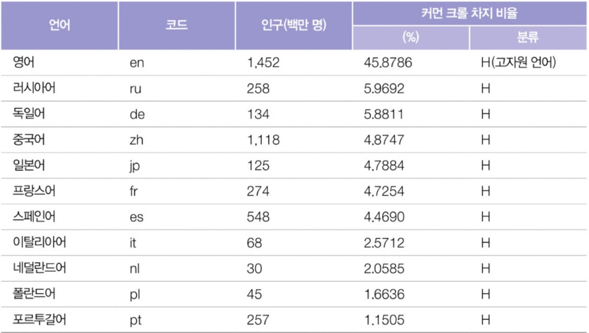

# 2장.

날짜: 2025년 11월 27일
담당자: 김성언
진행 상태: In Progress

## 2. 파운데이션 모델 이해하기

- 파운데이션 모델 설계 요소
    - 학습 데이터
    - 모델 아키텍처와 크기
    - 사람의 의도에 맞추는 사후 학습하는 방식
- 이 장에서는
    1. 모델 개발자가 학습 데이터를 수집하는 방법 ← 학습 데이터의 분포 (이후 9장에서 자세히)
    2. 트랜스포머 아키텍처가 대세인 이유? 새로운 구조는?
    3. 모델 개발 시 적절한 모델 크기를 정하는 방법
    4. 모델의 학습 과정
        1. 사전 학습
        2. 사후 학습 (Goal: 사람의 의도에 맞게 작동하도록 하는 것; 사람의 의도란? 모델이 학습할 수 있는 형태로 어떻게 표현할 수 있을까?)
    5. 모델 성능에 샘플링이 미치는 영향(대부분 간과하는 사실)

---

## 2.1 학습 데이터

데이터를 충분히 확보하면 좋겠지만, 어렵고 비용이 많이 든다

따라서, 구할 수 있는 데이터를 계속 활용하는 경우가 많다 

ex) 커먼 크롤: 비영리 단체에서 인터넷 웹사이트를 주기적으로 크롤링해서 데이터셋을 만듦(2022, 2023년 매월 20~30억 개의 웹 페이지를 크롤링) ← 정제되지 않은 데이터가 많다. (신뢰성이 떨어지는 가짜 뉴스가 많이 포함)

ex) C4: 구글이 공개한 커먼 크롤의 정제된 부분집합

- 휴리스틱
    - ex) 레딧에서 최소 3개 이상 추천 받은 게시글(오픈 AI가 GPT-2 시에, But, 100% 좋은 데이터라고 할 수는 없다)
- 데이터 품질의 중요성
    - ‘일반 데이터와 전문 데이터를 모두 사용해 모델을 학습하면 되지 않을까?’
    - 적응 양의 고품질 데이터로 학습한 모델이 대량의 저품질 데이터로 학습한 모델보다 더  나은 성능을 보일 수 있다
    - ex) 구나세카르 연구: 70억 개의 고품질 코딩 데이터 토큰을 사용해 13억 개의 파라미터를 가진 모델 학습 ← 더 큰 모델들 보다 좋은 성능

### 2.1.1 다국어 모델

- 대규모 언어 모델 학습에 널리 쓰이는 커먼 크롤의 주요 언어 분포
    
    
    
    표 2-1 대규모 언어 모델 학습에 널리 쓰이는 커먼 크롤의 주요 언어 분포
    
    - 영어가 전체 데이터의 거의 절반(45.88%)을 차지해 2번째로 많이 사용되는 언어인 러시아어 (5.97%)보다 8배 더 많이 사용되고 있다
    - 1% 이하로 사용되는 언어들(저자원 언어)은 AI를 학습시키는 데 사용할 수 있는 언어가 부족하다.
    - 사용 인구가 많음에도 커먼 크롤에서는 그 비중이 과소 대표되는 언어들이 있음
    - ex) 펀자브어, 스와힐리어, 우르두어 칸다나어 등
- **데이터의 양과 성능의 관계[답변 품질]**
    - 데이터 중에서 영어가 많다는 점을 고려하면 영어가 좋은 성능을 보이는 것은 당연하다
    - GPT-4는 영어로 된 문제를 다른 언어로 된 문제보다 훨씬 더 잘푼다.
        
        → 해당 언어가 적게 포함되어 있기 때문이다. But, 데이터가 적은 것이 성능 저하의 유일한 이유는 아니다.
        
    - 영어의 성능이 좋으니 다른 언어로 된 질의를 영어로 번역하고 응답을 받은 뒤 원래 언어로 번역하면 되지 않을까?
        - 데이터가 적은 언어를 충분히 이해해 번역할 수 있는 모델이 필요
        - 번역 과정에서 정보가 손실될 수 있다
- **데이터의 양과 성능의 관계[속도 및 비용]**
    - 언어별로 토큰화 효율성의 차이가 있다.
        
        ex) 버마어와 힌디어 같은 언어가 영어나 스페인어보다 동일 의미 전달에 훨씬 많은 토큰이 필요
        

---

### 2.1.2 도메인 특화 모델

- 언어뿐 아니라 **어떤 주제·도메인 데이터를 얼마나 봤는지**도 중요
- 일반 파운데이션 모델은 **넓은 도메인에 무난한 성능**을 보이지만,
    - 의료·법률·코드·금융 등 **특정 영역 전문성**은 부족
        
        **→ 도메인 특화 모델**을 따로 파인튜닝
        

---

## 2.2 모델링

- 데이터가 준비되면, 다음은 **모델을 어떤 구조와 크기로 만들 것인가**의 문제

### 2.2.1 모델 아키텍처

### 1) RNN·seq2seq의 한계

- RNN 기반 seq2seq는 한때 기계번역의 표준이었으나,
    - **긴 문장**을 처리할 때 정보가 뒤로 갈수록 희미해지고,
    - 병렬화가 잘 안 되어 **학습·추론이 느리다**는 문제

### 2) Transformer와 어텐션

- **Transformer**는 RNN 대신 **어텐션 메커니즘**으로 문맥을 처리
- 핵심 개념
    - 입력 토큰 각각을 세 벡터로 변환: **Query(Q)**, **Key(K)**, **Value(V)**.
    - Query와 모든 Key의 내적(dot product)을 통해 가중치를 계산.
        
        → softmax로 정규화해 **어텐션 분포**를 만들고 그 가중치로 Value들을 활용하여 새 표현을 만듦.
        
- 장점:
    - 모든 토큰 쌍의 관계를 한 번에 계산 → **긴 문맥 처리에 유리**.
    - 행렬 연산 위주라 GPU/TPU에서 **대규모 병렬화**가 가능
- 현재 GPT, Llama, PaLM 등 대부분의 LLM은 **Transformer 계열 아키텍처**를 사용

---

### 2.2.2 모델 크기

### 1) 파라미터 수와 LLaMA 예시

- 파라미터가 커질수록 표현력은 늘지만,
    
    **학습에 필요한 데이터 양과 FLOPs, 비용**이 함께 폭발적으로 증가
    

### 2) 다른 아키텍처 실험

- Transformer 외에도 **RWKV, SSM(State Space Model), Mamba, Jamba** 등
    
    긴 시퀀스를 더 효율적으로 처리하려는 시도들..
    

### 3) MoE(전문가 혼합, Mixture-of-Experts)

- 최근에는 거대한 모델을 여러 **전문가 서브모델**로 쪼개고,
    
    각 토큰마다 일부 전문가만 활성화하는 **MoE 구조**
    
- 총 파라미터 수는 크지만, 한 번의 추론에 사용하는 파라미터는 적은 형식으로 **연산 효율을 개선**

### 4) 스케일링 법칙과 컴퓨팅 비용

- FLOPs를 기준으로 학습연산량, 성능 사이의 관계

### 5) 데이터·컴퓨팅 스케일링의 현실

- 더 큰 모델을 만들수록:
    - 웹에 남은 **새로운 고품질 텍스트**가 점점 부족해지고,
    - 점점 더 많은 비율이 AI **모델이 만든 합성 데이터**가 되지 않을까..

## 2.3 사후학습 (Post‑training)

사후학습은 거대 언어 모델을 사전학습(pretraining) 후, **사람이 쓰기 좋은 형태**로 다듬는 추가 학습 단계

**ex) 지도 파인튜닝(SFT)** 과 **선호도 파인튜닝(RLHF 등)**

### 2.3.1 지도 파인튜닝

- **데이터 형태**
    - 입력: 사용자 프롬프트(질문·명령).
    - 출력: 사람이 직접 작성한 “이상적인 답변”.
    - 예: InstructGPT용 데이터에서, ‘serendipity’ 같은 개념에 대해 정의, 예시, 반례를 함께 적어 주는 식의 고품질 지시 데이터 세트
- **특징**
    - 사전학습 데이터(수백억 토큰)에 비해 **사후학습 데이터는 매우 작지만(수만 건 수준)** 품질·다양성이 중요
    - 모델 아키텍처는 그대로 두고, 이 (입력, 정답) 쌍에 대해 일반적인 지도학습(교차엔트로피 손실)으로 추가 학습
- **한계**
    - 애매한 가치 판단(공격적 발언, 안전성 등)을 표현하기 어려움
    → 추가적인 정렬 방법이 필요하다.

---

### 2.3.2 선호도 파인튜닝

사용자가 실제로 **더 선호하는 출력 만들기**
단순히 “정답”이 아니라, **도움이 되고, 정중하고, 안전한 답**

1. **데이터 수집 (비교·랭킹)**
    - SFT 모델로 하나의 프롬프트에 대해 여러 답을 생성하고,
    - 사람이 “A가 B보다 낫다”처럼 순위를 매긴다.
2. **보상 모델(reward model)**
    - 입력·출력 쌍 ((x,y)) 에 점수 (r(x,y))를 주도록 학습.
    - 선호 데이터(좋은 y, 나쁜 y)를 보고 훈련
3. **정책 최적화**
    - RLHF: PPO 같은 강화학습으로 다음과 같이 계산
        
        
        

---

## 2.4 샘플링

샘플링 모델이 출력을 생성하는 단계

### 2.4.1 샘플링의 기초

- 모델은 주어진 문맥에서 각 토큰에 대한 **logit(점수)** 를 출력하고, softmax로 확률 분포를 만듦
- 예시: “What’s your favorite color?” 뒤에
    - ‘green’ 50%, ‘red’ 30%, ‘the’ 0.2% … 같은 분포가 생기고, 거기서 토큰을 하나씩 뽑아 문장을 이어감
- **온도(temperature)**
    
    
    
    - softmax 전에 점수를 (x_i / T)로 나눠 분포의 날카로움 조절
    - **T ↓** (예: 0.1): 가장 확률 높은 토큰에 몰려 **결정론적·반복적** 출력
    - **T ↑** (예: 1.5): **다양하지만 불안정**한 출력

---

### 2.4.2 샘플링 전략

1. **Greedy / Argmax**
    - 매 단계에서 가장 확률 높은 토큰만 선택.
    - 구현은 간단하지만, 전반적으로 품질이 낮고 같은 패턴을 반복하는 경향이 강함
2. **Top‑k 샘플링**
    
    
    
    - 확률 상위 k개 토큰만 남기고 나머지는 0으로 만든 후, 그 안에서 다시 샘플링
    - k가 작으면 보수적, 크면 greedy에 가까워짐
3. **Top‑p (nucleus) 샘플링**
    
    
    
    - 높은 확률 토큰부터 누적확률이 p(예: 0.9)에 도달할 때까지 포함시키고 그 집합에서 샘플링
    - 문맥에 따라 후보 개수가 달라지므로, 동적으로 꼬리를 조절하는 효과가 있다
4. **기타 파라미터**
    - **min‑p** 등은 확률이 너무 작은 토큰을 완전히 제거해 이상한 문장을 줄이는 실험적 기법 등
5. 중단 조건
    - 일정 개수의 토큰 생성 후 멈추기
    - 중단 토큰이나 중단 단어를 사용
    
    → 조기 중단으로 인해 출력 형식이 잘못될 수 있다 ex) JSON 생성 요청 중 중단
    

---

### 2.4.3 테스트 시점 연산 (Test‑time compute)

같은 모델이라도 **추가 연산을 얼마나 쓰느냐**에 따라 출력 품질을 높일 수 있다.

- **Best‑of‑N 샘플링**
    - 같은 프롬프트에 대해 N개의 답을 생성하고, 전체 시퀀스의 log probability 합이 가장 높은 것을 선택
- **한계**
    - log probability가 사람의 “좋은 답”과 항상 일치하지 않음
- **트레이드오프**
    - N을 키우면 성능은 좋아지지만, 응답 시간이 늘고 비용이 증가.

---

### 2.4.4 구조화된 출력

- **필요성 예시**
    - 자연어 → SQL(Text‑to‑SQL, Text‑PostgreSQL): 모델이 질의를 SQL로 변환해 DB 질의에 바로 쓸 수 있도록
    - API 응답: 반드시 정해진 JSON 스키마를 따라야 하는 경우 등
- **단순 프롬프트 기반 접근**
    - “아래 JSON 스키마를 따라라”라고 지시하고 예시를 제공하면 어느 정도 형식이 맞지만, 종종 잘못된 JSON을 출력하기 때문에 후처리 단계가 필요하다.
- **제약 샘플링 (Constrained decoding)**
    - 정규식·문법(EBNF 등)으로 허용 가능한 문자열을 정의하고 샘플링 시 그 제약을 만족하는 토큰만 선택
    - 예: US 전화번호 정규식, 이메일 주소 패턴, 날짜 형식 패턴 등.
- **후처리(Post‑processing)**
    - 모델 출력(JSON/YAML 등)을 파서로 검증하고, 오류가 있으면 자동으로 수정·재생성하는 파이프라인

---

### 2.4.5 AI의 확률적 특성

- **확률적 출력**
    - 모델은 같은 입력에 대해서도 **여러 가능한 답 중 하나를 샘플링**한다.
    - 예시: 어떤 문장의 번역에서 A가 70%, B가 30% 확률일 때, 한 번 호출해서 B가 나오면 “모델이 갑자기 이상해졌다”고 느끼지만, 사실은 분포 상 합리적인 결과
- **비일관성의 두 가지 양상**
    1. **같은 입력, 여러 번 호출** → 답변 길이·스타일이 달라짐.
    2. **비슷하지만 다른 입력** → 질문을 조금만 바꿔도 모델이 다른 단서를 잡아 전혀 다른 답을 낼 수 있음.
- **환각(hallucination)**
    - 모델은 언어 패턴을 예측할 뿐 사실 여부를 검증하지 않음
    - 그럴듯하지만 틀린 정보, 존재하지 않는 논문·URL·API 등을 매우 자연스럽게 만든다..
    - 따라서 모델의 답을 곧바로 “사실”로 받아들이지 말고, 검색·도구 호출·후속 질문 등을 통해 검증하는 시스템 설계가 중요