# 3장. 평가 방법론

---

## 3장 전체 개요 – 왜 평가가 중요한가

- 많은 파운데이션 모델이 언어 모델 요소를 가지고 있으므로, 이번 장에서는 교차 엔트로피와 퍼플렉시티 같은 언어 모델 평가에 쓰이는 지표들을 간단히 사펴본다.
- 파운데이션 모델은 개방형이라서 특히 평가가 어렵다
    - 여전히 사람 평가자의 역할이 필수적임
    - AI 자체를 AI 평가자로 활용하는 방법도 떠오르고 있음

---

## 3.1 파운데이션 모델 평가의 어려움

- 전통적 ML 평가에 비해 파운데이션 모델 평가가 더 어려운 이유
1. **AI 모델이 똑똑해질수록 평가가 더 어려워진다.**
2. **파운데이션 델은 개방형 특성으로 인해, 정답을 기준으로 성능을 평가하는 기존 방식은 더 이상 유요하지 않다.**
3. **대부분의 파운데이션 모델은 블랙박스로 취급된다**
    1. **모델의 세부 사항 공개 x**
    2. **애플리케이션 개발자가 이해할 전문지식 부족**
    3. **공개적으로 이용 가능한 평가 벤치마크들은 파운데이션 모델을 평가하는데 부적절한 것으로 판명**
        1. GLUE, SuperGLUE, NaturalInstructions, MMLU, MMLU-Pro
4. 범용 모델의 평가 범위가 확장됐다.
    1. 알려진 작업 뿐만아니라 새로운 작업을 발견하는 것도 파홈된다.(AI의 잠재력과 한계 탐구)

## 3.2 언어 모델링 지표 이해하기

- 파운데이션 모델: 언어 모델에서 발전, 여전히 언어 모델을 핵심 구성 요소로 활용
- 언어 모델링의 지표를 이해하면 애플리케이션의 성능을 이해하는 데 큰 도움이 될 수 있다.
- 대부분의 자기회귀 언오 모델은 교차 엔트로피나 관련된 퍼플렉시티를 사용해 학습된다.

cf) BOC, BPB도 교차 엔트로피의 변형된 형태

<aside>

교차 엔트로피, 퍼플렉시티, 문자당 비트(BPC), 바이트당 비트(BPB)
ㄴ> 4가지 지표는 필요한 정보가 있다면 하나의 값으로 나머지 셋을 계산할 수 있다

</aside>

- 언어 모델은 언어에 대한 통계적 정보를 인코딩한다
    
    → 모델이 더 많은 통계 정보를 파악할수록 다음 토큰을 더 잘 예측할 수 있다.
    

### 3.2.1 엔트로피

- **엔트로피**: 토큰이 평균적으로 얼마나 많은 정보를 담고 있는지 측정, 높을 수록 각 토큰이 더 많은 정보를 담고 있으며, 토큰을 표현하는 데 더 많은 비트가 필요함
    
    →언어에서 다음에 올 것을 예측하기가 얼마나 어려운지를 보여줌
    

### 3.2.2 교차 엔트로피

- **교차 엔트로피 H(P)**: 언어 모델이 데이터셋의 내용을 얼마나 예측하기 어려워하는지를 보여주는 지표
- 교차 엔트로피 결정 특성
    - 학습 데이터의 예측 가능성, (학습 데이터의 엔트로피로 측정)
    - 언어 모델이 파악한 분포가 학습 데이터의 실제 분포와 얼마나 다른지
    
    <aside>
    
    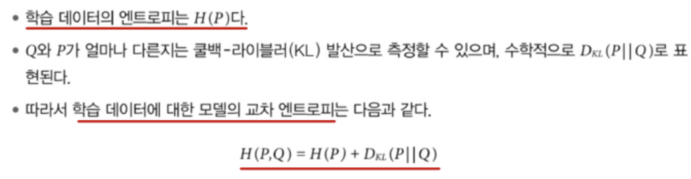
    
    </aside>
    
- 학습 데이터에 대한 교차 엔트로피를 최소화하도록 학습된다.
    - 모델이 완벽하게 학습하면 모델의 교차 엔트로피는 학습 데이터의 엔트로피와 정확히 일치함.
    - 이때 P에 대한 Q의 KL 발산은 0
        - 모델의 교차 엔트로피는 학습 데이터의 엔트로피에 대한 근삿값으로 볼 수 있다.

### 3.2.3 문자당 비트 / 바이트당 비트

- 엔트로피와 교차 엔트로피의 단위는 비트를 사용한다
    
    ex) LM의 교차 엔트로피가 6비트 → 각 토큰을 표현하는 데 6비트가 필요 
    
    cf) 토큰화 방식의 차이로 토큰당 비트 수로 모델을 비교할 수 없다. (BPC:문자당 비트를 사용하기도 함/ But, 문자 인코딩 방식이 다양하다는 문제점)
    

### 3.2.4 퍼플렉서티(perplexity)

- **퍼플렉서티(PPL): 엔트로피와 교차 엔트로피의 지수 함수,** 다음 토큰을 예측할 때의 불확실성을 측정(높을수록 다음 토큰의 선택지가 많다는 뜻)

<aside>

언어 모델(학습된 분포 Q)의 퍼플렉시티 = PPL(P,Q) = $2^{H(P,Q)}$

</aside>

### 3.2.5 퍼플렉서티 해석과 활용 사례

- 데이터셋에서 다음에 올 것을 예측할 때 **불확실성이 클수록 퍼플렉시티가 높아진다.!**
- 퍼플렉시티를 해석할 대 사용할 수 있는 일반적인 규칙들
    - 구조화된 데이터일수록 퍼플렉시티가 낮다.
    - 어휘 크기가 클수록 퍼플렉시티가 높다.
    - 컨텍스트 길이가 길수록 퍼플렉시티가 낮다.

<aside>

퍼플렉시티는 사후 학습된 모델을 평가하는 데는 적절한 지표가 아닐 수 있다.

특정 작업을 잘 수행하도록 가르치는 과정에서 다음 토큰을 예측하는 능력은 떨어질 수 있다.

</aside>

---

## 3.3 정확한 평가

- AI 평가자는 주관적이다.. (같은 글도 나중에 보면 다르게 채점한다.)
- 정확한 점수를 산출하는 평가 방식
    - 기능적 정확성
    - 참조 데이터의 유사도 측정

### 3.3.1 기능적 정확성

- 시스템이 의도한 기능을 제대로 수행하는지를 평가
- 코딩처럼 정답이 명확한 작업은 모델의 출력의 기능적 정확성을 파악할 수 있다.
- ex) Python 함수 `gcd(num1, num2)` 작성 요청

### 3.3.2 참조 데이터를 사용하는 측정

- 기능적 정확성으로 자동 평가할 수 없는 작업이라면 
AI의 출력을 참조 데이터와 비교해 평가
    
    ex) 프랑스어 문장을 영어로 번역할 때, “생성된 영어 번역문”을 정답 영어 번역문과 비교하여 평가
    
- 개방형 텍스트 간의 유사도를 측정하는 방법
    - 비교: 평가자에게 두 텍스트가 같은지 판단하도록 요청
    - 정확한 일치:생성된 응답이 참조 응답 중 하나와 정확히 일치하는지 여부
    - 어휘적 유사도: 생성된 응답이 참조 응답과 얼마나 비슷해 보이는지
        - 근사 문자열 매칭(퍼지 매칭): 편집 거리 세기
        - n-gram 유사도
        - 지표: BLEU, ROUGE, METEOR++, TER, CIDEr 등
    - 의미적 유사도: 생성된 응답이 의미에서 참조 응답과 얼마나 가까운지

### 3.3.3 임베딩 소개

- 임베딩(embedding) 은 텍스트·이미지 등 입력을 고차원 벡터로 표현
- 임베딩 활용
    - RAG
    - 비슷한 응답끼리 묶기
    - 의미적 유사도 평가
- 서로 다른 유형의 데이터에 대한 통합 임베딩
    
    ex) CLIP
    
    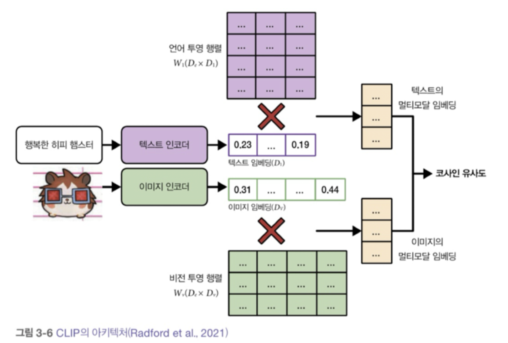
    
- (이미지,텍스트)쌍을 각각 인코더로 임베딩한 뒤 같은 쌍은 가깝게, 다른 쌍은 멀게 학습

---

## 3.4 AI 평가자

### 3.4.1 AI 평가자를 쓰는 이유

- 빠르고, 사용하기 쉬우며, 비용도 저렴하고, 참조 데이터 없이도 작동한다
- 사람 평가자들과 AI 평가자는 높은 상관관계를 보인다

### 3.4.2 AI 평가자 사용법

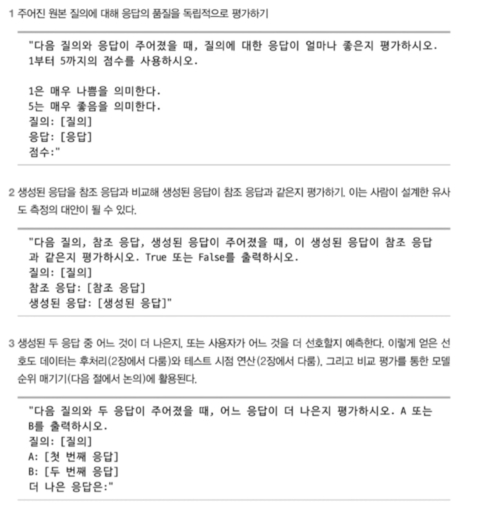

- AI 평가의 기준은 표준화되어 있지 않다.
- AI 평가자 프롬프트 지침
    
    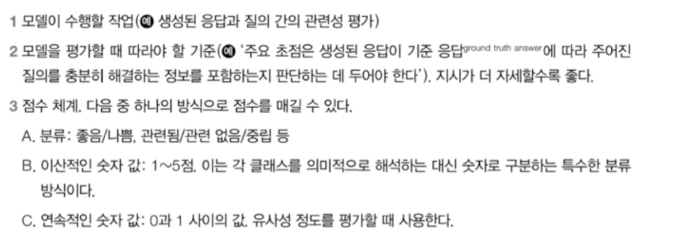
    
    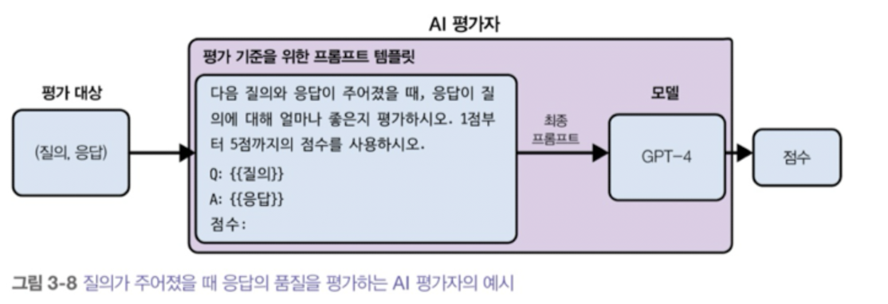
    
    cf) AI 평가자는 단순히 모델만 있는 것이 아니라 모델과 프롬프트를 모두 포함하는 시스템
    

---

## 3.4.3 AI 평가자의 한계

1. 비일관성(variability)
    - AI 애플리케이션처럼 AI 평가자 또한 확률적이다.
    - 샘플링 변수, 프롬프트에 평가 예시 포함을 통해서 일관성 향상 가능
    - But, 높은 일관성이 높은 정확도를 의미하지 않으며, 추론 비용도 높인다.
2. 평가 기준의 모호성
    - AI 평가자의 지표는 표준화되지 않아서 잘못 해석하고 오용하기 쉽다.
    - 충실성(컨텍스트에서 생성된 출력이 원본 내용을 얼마나 정확히 반영하는지)라는 기준이 있지만 지시와 점수 체계가 도구별로 모두 다르다.
3. 비용·지연 시간 증가
    - 강력한 모델로 응답을 생성하고  평가하면 호출이 두 배, 비용도 거의 두 배
        - 덜 똑똑한 모델을 평가자로,,?(4장에서 다룸)
4. AI 평가자의 편향
    - 사람 평가자처럼 AI 평가자도 편향이 있음
    - 다른 모델이 생성한 응답보다 자신의 응답을 선호
    - +) 첫 위치 편향, 장황성 편향(긴 응답 선호)

---

## 3.4.4 평가자로 활용 가능한 모델

- 성능: 평가 > 생성
    - 왜 더 약한 모델을 응답을 생성하나?
    - 비용과 지연 시간
    - 내부 개발 모델로 응답을 생성하고 1프로만 좋은 모델로 평가
    - 문제점: 1( 강력한 모델을 평가할만한 평가자 X, 어떤 모델이 가장 강력한지 판단하기 위한 평가방법 필요
- 특화된 평가자의 예시

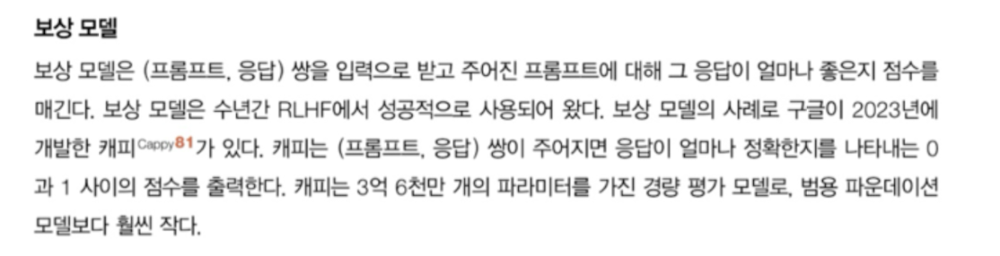

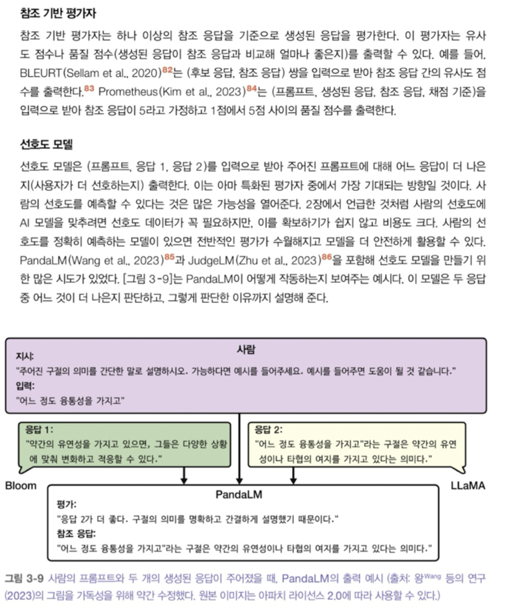

---

## 3.5 비교 평가를 통해 모델 순위 정하기

## 3.5.1 비교 평가의 과제들

- 확장성 병목
    - 비교 평가는 **기본적으로 데이터가 많이 필요하다.**
    - **비교할 모델 쌍의 수는 모델 수의 제곱에 비례**하여 증가한다.
    
    예) LMSYS: 57개의 모델, 244,000번 비교 → 모델 쌍당 평균 153번 비교.
    
    - 순위 알고리즘은 보통 **전이성을 가정**한다.
        - “모델 A가 B보다 순위가 높고 B가 C보다 순위가 높다면 A의 순위가 C보다 높다”는 가정.
- 표준화와 품질 관리의 부재
    - 비교 결과를 수집하는 한 가지 방법은 **LMSYS 챗봇 아레나처럼 커뮤니티에 비교를 맡기는 것**이다.
    - 누구나 웹사이트에 접속해서 프롬프트를 입력하고 **임의의 두 모델에서 나온 두 응답**을 받아본 뒤, **더 나은 것에 투표**할 수 있다.
    - 장점: **다양한 비교 결과를 얻을 수 있고 조작하기도 비교적 어렵지 않다.**
    - 단점: **표준화와 품질 관리를 강제하기 어렵다.**
        - 누구나 아무 프롬프트나 사용할 수 있다.
        - 어떤 응답이 더 나은지에 대한 **기준이 없다.**
        - 응답의 사실 관계를 확인하기 어렵다.
- 비교 성능에서 절대 성능으로
    - 많은 애플리케이션에서 **반드시 최고의 모델이 필요하진 않다.**
    - **필요한 수준의 성능을 내는 모델이면 충분하다.**
    - 비교 평가는 **어떤 모델이 더 나은지 알려주지만**, **모델이 얼마나 좋은지**는 알려주지 않는다.
    - “모델 B가 모델 A보다 낫다는 순위를 얻었다”고 해도, 가능한 시나리오:
        1. 모델 B는 좋지만 모델 A는 나쁘다.
        2. 모델 A와 B 모두 나쁘다.
        3. 모델 A와 B 모두 좋다.
    - 어느 시나리오인지 알려면 **다른 형태의 평가**가 필요하다.

---

## 3.5.2 비교 평가의 미래

- **두 출력을 비교하는 것이 각 출력에 구체적인 점수를 매기는 것보다 쉽다.**
- 모델이 더 강력해져서 사람의 성능을 뛰어넘게 되면, **사람 평가자가 모델 응답에 구체적인 점수를 매기는 것이 불가능해질 수 있다.**
    
    → 사람 평가는 여전히 **두 응답의 차이를 구별할 수 있기 때문에**,비교 평가는 **유일한 대안이 될 수 있다.**
    
- 비교 평가는 우리가 중요하게 여기는 **품질, 즉 사람의 선호도를 파악하는 것을 목표로** 한다.
    - **AI의 끊임없이 확장되는 능력을 따라잡기 위해 계속해서 새로운 벤치마크를 만들어야 하는 부담을 줄여준다.**
    - 비교 평가는 **참조 데이터로 모델을 학습시키는 것 같은 편법을 쓰기 어렵기 때문에** 상대적으로 **조작하기 어렵다.(**많은 사람이 **다른 어떤 공개 순위표보다 공개 비교 순위표의 결과를 더 신뢰하는 이유)**

---

## 4장 AI 시스템 평가하기

- 4장은 **모델이 아니라 애플리케이션 전체**를 평가 대상으로 둔다.

---

## 4.1 평가 기준

- 배포되지 않은 애플리케이션이라도 **기본적인 평가 기준**이 필요하다.
- 제약? 한계?를 정확히 알 수 없는 애플리케이션에서 무작정 성능을 높이려 하면 비용이 더 발생할 수 있다.
- 평가 주도 개발
    - 애플리케이션을 만들기 위해 시간과 돈을 투자하기 전에, 애플리케이션을 어덯게 평가할지 이해하는 것 (테스트 주도 개발에서 영감)
    - 개발하기 전에 평가 기준을 정의하는 것

---

## 4.1.1 도메인 특화 능력

- 도메인 특화 능력(domain-specific capability)은 **특정 분야의 지식/규칙을 이해하고 수행하는 능력**

---

## 4.1.2 생성 능력

### 자연어 생성 능력

- 생성형 AI는 **자연어 생성(NLG)** 의 연장
- 요약, 번역, 질의응답, 스토리 생성, 코드 작성 등 다양한 형태의 출력이 모두 생성 능력에 포함된다.
    
    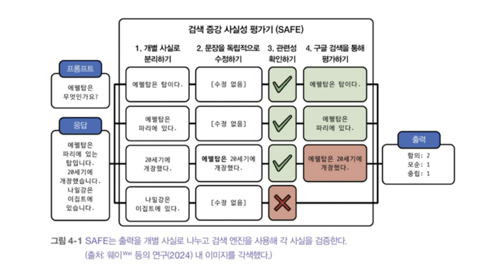
    

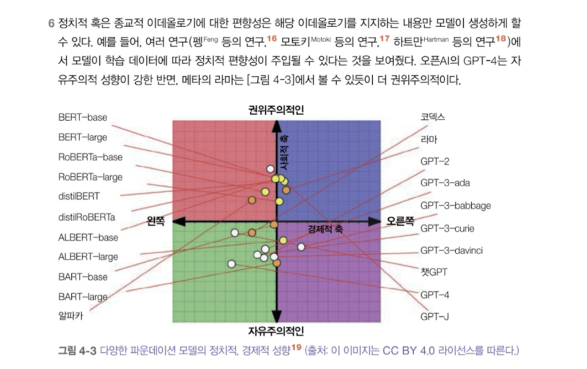

## 4.1.3 지시 수행 능력

- 이 모델이 주어진 지시를 얼마나 잘 따르는가?
- JSON 형식, 정규 표현식 같은 구조화된 출력이 필요한 애플리케이션에서 필수적
- 도메인별 능력이나 생성 능력과 쉽게 혼동될 수 있어서 정의하거나 측정하기가 쉽지 않다.
- 지시 수행 기준
    - 벤치마크마다 지시 수행 능력이 포함하는 내용이 다르다
    
    → 자신만의 기준을 사용해 모델의 지시 수행 능력을 평가하기 위한 벤치마크를 만들어야 한다.
    
- 역할 연기
    - 가상 캐릭터나 페르소나를 가정하도록 요청하는 것
        - 사용자가 상호 작용할 수 있도록 캐릭터를 연기
        - 모델의 출력 품질을 향상시키이 위해 프롬프트 엔지니어링 기법으로 역할 연기

## 4.1.4 비용과 지연 시간

- 고품질 결과물을 생성하지만 너무 느리고 비용이 많이 드는 모델을 쓸모가 없다
- 품질, 지연 시간, 비용의 균형을 맞추는 것이 중요하고 이러한 여러 목표를 최적화하는 연구를 “파레토 최적화”라 한다
- 파운데이션 모델의 지연 시간 지표: 첫 토큰까지 걸리는 시간, 토큰당 시간, 토큰 간 시간, 질의당 시간 등
- 규모에 따라 모델 API를 사용할지, 자체 모델을 호스팅할지 결정해야한다.
    
    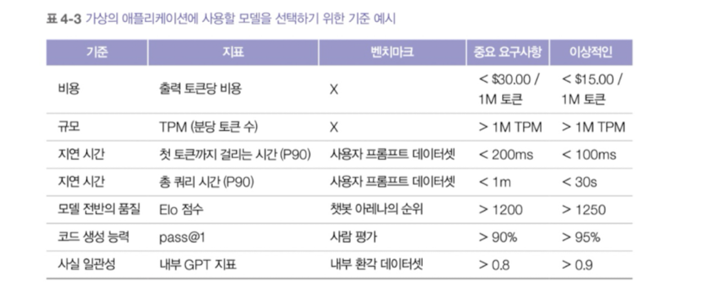
    

## 4.2 모델 선택

## 4.2.1 모델 선택 과정

- 비현실적인 하드 속성과 변경할 수 있는 소프트 속성을 구별하는 것이 중요
- 전반적인 평가 과정
    - 하드 속성이 적합하지 않은 모델 걸러내가
    - 공개된 정보를 활용해 가장 유망한 모델 추리기(여러 목표를 균형있게 고려)
    - 자체 평가 파이프라인으로 실험을 수행
    - 운영 환경에서 모델을 지속적으로 모니터링

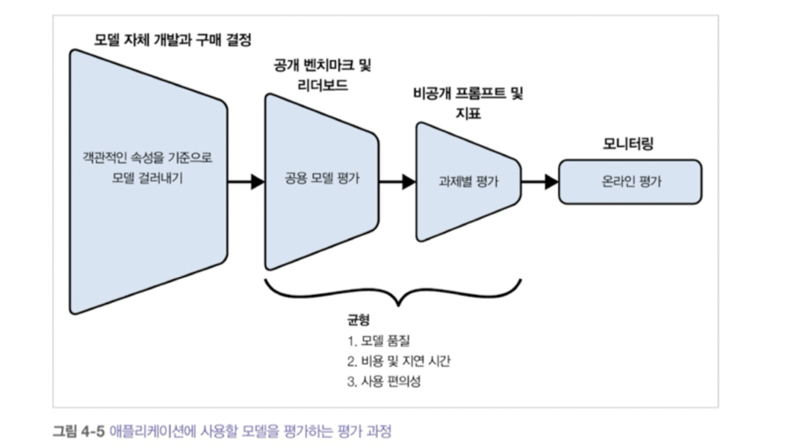

## 4.2.2 모델 자체 개발 대 사용 모델 구매

- 오픈소스, 오픈 가중치, 모델 라이선스
    - 오픈소스를 모델 뿐만 아니라 학습 데이터도 공개적으로 제공될 때로 봐야하는 의견이 있음
    - 모델만 공개한 것은 오픈 웨이트(대다수는 오픈 웨이트)
    - 모델의 라이선스도 고려하여 사용을 해야한다
        - 상업적 사용 허용하는가?
        - 사용 허용시 제한이 있는가?
        - 모델 출력을 다른 모델의 학습이나 개선에 사용하는 것을 허용하는가?

<aside>

- 모델의 호스팅/API 사용 여부를 결정하는 요소
    - 데이터 프라이버시: 조직 외부에서 데이터를 전송할 수 있나?
    - 데이터 계보
    - 성능: 오픈소스 모델이 사용 모델을 뛰어넘진 못할 것이다.
        
        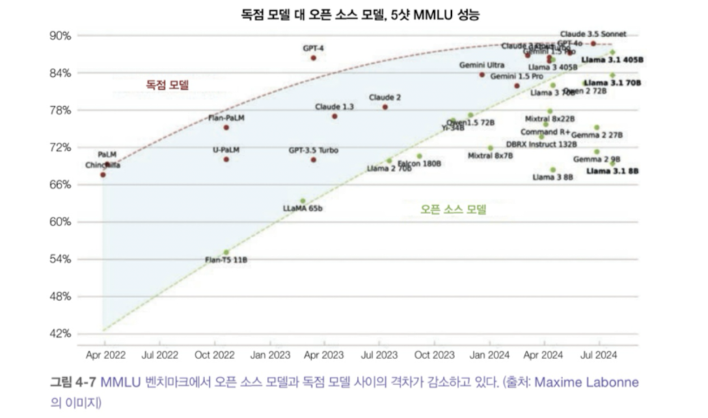
        
    - 기능성
        
        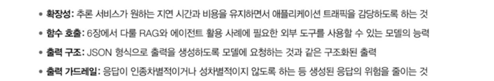
        
    - 비용
    - 제어
        
        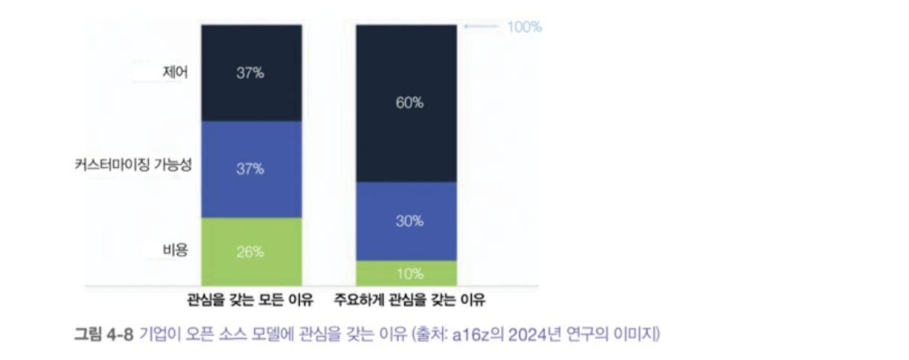
        
    - 온디바이스 배포: 인터넷 환경이 필요한가 아닌가 등
</aside>

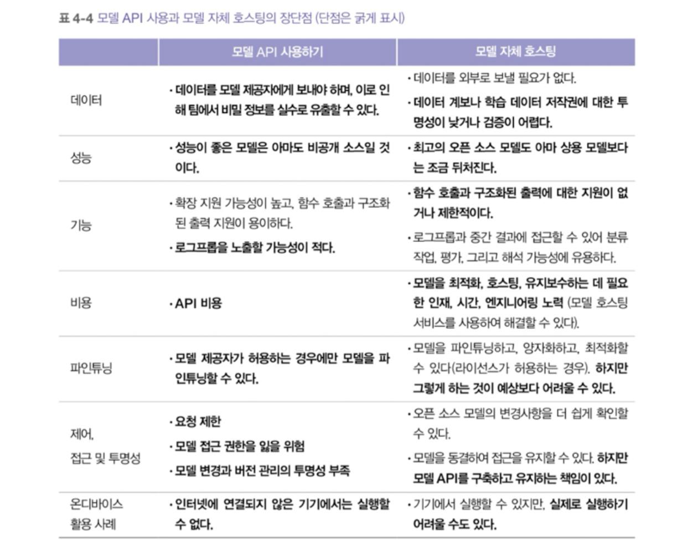

## 4.2.3 공개 벤치마크 탐색하기

- 벤치마크 선택 및 집계
    - 리더보드에 어떤 벤치마크를 포함할 것인가
    - 모델 순위를 매기기 위해 이런 벤치마크 결과를 어떻게 집계할 것인가?
- 공개 벤치마크로 맞춤형 리더보드 만들기
    - 특정 애플리케이션용 모델을 평가할 때, 사실상 자신만의 평가 기준으로 모델 순위를 매기는 개인 리더보드를 만드는 것이다.

## 4.3 평가 파이프라인 설계하기

- AI 애플리케이션의 성공 여부는 좋은 결과와 나쁜 결과를 구분하는 능력에 달려 있다.
- 이를 위해서는 신뢰할 수 있는 평가 파이프라인(evaluation pipeline) 이 필요하다.
- 평가 방법과 기술이 폭발적으로 증가하면서, 평가 파이프라인에 맞는 조합을 고르기 혼란스러울 수 있다.

---

## 4.3.1 1단계: 시스템의 모든 구성 요소 평가하기

- 실제 AI 애플리케이션은 복잡하며, 여러 구성 요소와 여러 단계를 거쳐 완료된다.
- 평가는 과제별, 단계별, 중간 출력별로 다양한 수준에서 이뤄질 수 있다.
- 엔드투엔드 출력과 각 구성 요소의 중간 출력을 독립적으로 평가해야 한다.
- 예시: PDF에서 현재 직장을 추출하는 애플리케이션
    1. PDF에서 모든 텍스트를 추출한다.
    2. 추출된 텍스트에서 현재 직장을 찾아낸다.
        - 두 단계 중 어느 단계에서 실패했는지 파악하기 위해
            - 1단계에서는 추출된 텍스트와 실제 텍스트의 유사도를 평가하고,
            - 2단계에서는 현재 직장을 얼마나 정확하게 찾았는지를 평가한다.
        - 가능하다면 턴별, 작업별로도 평가할 수 있다.
    
- 턴 기반 평가 / 작업 기반 평가
    - 턴 기반 평가(turn-based evaluation)
        - 각 출력물의 품질을 평가한다.
        - “이 턴의 응답이 과제 수행에 도움이 되었는가?”와 같은 관점
    - 작업 기반 평가(task-based evaluation)
        - 시스템이 과제를 완수했는지 평가한다.
        - “몇 번의 대화로 문제를 해결했는가?” 같은 관점

---

## 4.3.2 2단계: 평가 가이드라인 만들기

### 평가 가이드라인의 중요성

- 명확한 평가 가이드라인(evaluation guideline) 을 만드는 것은 평가 파이프라인에서 가장 중요한 단계 중 하나이다.
- 모호한 가이드라인은 모호한 점수로 이어지며 어떤 응답이 나쁜 응답인지 구분할 수 없게된다.

### 평가 기준 정의하기

- 평가에서 가장 어려운 부분은 좋은 응답이 무엇을 의미하는지 정의하는 것이다.

## 예시와 함께 평가 기준표 만들기

- 각 기준에 대해 평가 시스템을 선택해야 한다.
    - 이진값(0과 1), 1~5점 척도, 0~1 사이 연속값 등.

---

## 4.3.3 3단계: 평가 방법과 데이터 정의하기

- 기준과 평가 기준표를 만든 후, 애플리케이션을 평가하는 데 사용할 방법과 데이터를 정의한다.
- 이 단계에서는
    - 어떤 평가 도구(AI 평가자, 자동 지표, 사람 평가)를 쓸지
    - 어떤 데이터 세트(운영 로그, 시뮬레이션 데이터, 합성 데이터)를 쓸지 정한다.

### 평가 파이프라인 평가하기

1. **올바른 신호를 제공하는가?**
    - 더 나은 응답이 실제로 더 높은 점수를 받는가?
    - 더 나은 평가 지표가 실제로 더 나은 비즈니스 결과와 연결되는가?
2. **얼마나 신뢰할 수 있는가?**
    - 같은 파이프라인을 두 번 실행했을 때 결과 차이가 어느 정도인가?
    - 다른 평가 데이터셋으로 여러 번 실행했을 때 점수 분산이 얼마나 되는가?
    - AI 평가자를 쓸 경우, 파라미터(온도 등)를 고정해 **재현성**을 높여야 한다.
3. **지표 간 상관관계는 어떠한가?**
    - 서로 높은 상관이 있는 지표라면 둘 다 유지할 필요는 없다.
    - 반대로 전혀 상관이 없다면, 해당 지표가 **신뢰할 만한 통찰을 주는지** 다시 살펴봐야 한다.
4. **애플리케이션에 얼마나 많은 비용·지연을 추가하는가?**
    - 평가를 정교하게 할수록 자연 시간과 비용이 늘어난다.
    - 일부 팀은 평가를 줄이면서까지 지연 시간을 줄이기로 결정할 수 있는데,
        
        책은 이를 “위험한 도박”이라고 표현한다.
        

### 반복(Iteration)

- 요구사항과 사용자 행동이 변하면서 **평가 기준은 진화**해야 하고 평가 파이프라인도 반복적으로 개선되어야 한다.
- 기준을 업데이트하고, 기준표를 수정하며, 예시를 추가하거나 제거하는 작업이 필요하다.
- But, 파이프라인에서는 일정 수준의 **일관성**을 유지해 시간에 따른 성능 변화를 비교할 수 있어야 한다.