# 8장. 데이터셋 엔지니어링

날짜: 2026년 1월 14일
담당자: 김성언

# 8장. 데이터셋 엔지니어링

- 모델의 품질은 학습 데이터의 품질에 달려있다. 무한한 컴퓨팅 자원을 가진 세계 최고의 ML팀이랄도 데이터가 없으면 좋은 모델을 파인튜닝할 수 ㅇ벗다.

> **데이터셋 엔지니어링의 목표는 최고의 모델을 학습할 수 있는 데이터셋을 만드는 것**
(할당된 예산 내에서 달성)
> 
- 더 많은 회사가 AI 성능을 차별화하기 위해 데이터에 주목하고 있다. (데이터 처리는 더 어려워지고, 인력과 인프라에 대한 투자도 늘어나고 있다.)
- 데이터 운영은 더 이상 여유 시간에 처리하는 부수적인 업무가 아니라, 그 자체로 전문적인 전담 역할
    - 데이터 레이블러, 데이터셋 제작자, 데이터 품질 엔지니어
- 데이터 환경에 대한 개요, 자체 데이터셋을 구축할 때 고려해야 할 사항들
- 데이터 큐레이션, 어떤 데이터가 얼마나 필요한지, 고품질 데이터란?, 이미지 합성, 이미지 처리

<aside>

< 데이터 중심 AI의 관점 >

- AI 개발과정에서 데이터의 중요성이 커지면서 기존의 모델 중심 AI와 다른 데이터 중심 AI가 떠오르고 있다.
    - 모델 중심 AI: 모델 자체를 개선해서 AI 성능을 개선
    - 데이터 중심 AI: 데이터를 개선해서 AI 성능을 개선, 새로운 데이터 처리 기법을 개발, 고품질 데이터셋을 만들어서 더 적은 차원으로도 더 좋은 모델을 학습
- 딥러닝 초기에는 모델 AI 벤치마크 대부분이 모델 중심이었으나, 최근에는 데이터 중심 AI 벤치마크가 활성화되고 있다.
</aside>

## 8.1 데이터 큐레이션(Data curation)

- 모델이 어떻게 학습하는지, 학습에 도움이 되는 자원이 무엇인지 이해하는 분야
- 하려는 일과 모델에 따른 데이터의 종류
    - 자기 지도 학습 파인튜닝: 데이터 시퀀스
    - 지시 파인튜닝: 응답 형식 데이터
    - 선호도 파인튜닝: [지시, 선호 응답, 비선호 응답] 형식
    - 보상 모델: [지시, 선호 응답, 비선호 응답] 형식 또는 [(지시, 응답), 점수] 형식
    
- 복잡한 작업의 학습이 어려운 이유(ex: CoT, 도구 사용)
    - 생각의 사슬(CoT)
        - 모델이 최종 답을 내기 전에 문제를 단계별로 풀어보도록 유도한다.
        - 모델이 단계별 응답을 생성하도록 가르치려면 학습 데이터에 CoT 응답이 들어 있어야 한다.
        - 파인튜닝 데이터에 단계별 응답을 넣으면 여러 크기의 모델들이 CoT 작업에서 훨씬 좋은 성능을 보이고, 어떤 작업에서는 정확도가 거의 두 배까지 올라간다고 한다.
        - 여러 응답을 생성하는 것은 지루하고 시간도 오래걸린다. 최종 답을 알려주는 것보다 단계별로 풀어서 설명하는 것이 훨씬 더 어렵다.
    - **도구 사용**
        - 모델이 사전 학습 중에 습득한 방대한 지식을 생각해보면, 많은 모델이 특정 도구 사용법을 이미 알고 있다고 생각하는 경우가 많다.
        - But, 도구 사용 예시를 다시 보여주면 모델이 도구 사용 능력을 더 확실히 키울 수 있다.
        - 도구 사용 데이터는 보통 도메인 전문가를 활용한다.
        - 데이터셋의 각 프롬프트는 도구가 필요한 작업에 해당하며, 그에 대한 응답은 해당 작업을 수행하는 데 필요한 일련의 행동으로 구성된다.
        - 사람에게 효율적인 방법이 AI에게 효율적인 것은 아니다.
        - 도구 사용 데이터는 특별한 형식이 필요할 수도 있다.
            - 일반적인 대화 데이터에서는 사용자와 AI가 번갈아가며 턴마다 하나의 메시지를 주고 받는다.
            - But, 도구를 사용할 때는 AI가 한 턴에 여러 메시지를 만들어야할 수도 있고, 각 메시지는 다른 곳으로 보내진다.
                
                ex) 코드 인터프리터에 하난의 메시지를 보내고 사용자에게는 다른 메시지를 보낼 수 있다. (사용자에게 현재 자신이 무엇을 하고 있는지 알려주는 방식)
                
                → Llama 3 연구자들은 각 메시지의 출처와 목적지를 표시하는 메시지 헤더와 사람과 AI의 턴이 어디서 시작하는지 알려주는 특별한 종료 토큰으로 구성된 멀티 메시지 채팅 형식을 설계했다.
                
- 대화 인터페이스가 있는 애플리케이션용 데이터 큐레이션
    - 싱글 턴 데이터
        - 모델이 개별 지시에 답하는 법을 가르친다
        - 간단하여 구하기 쉽다.
    - 멀티 턴 데이터
        - 모델에게 작업을 해결하는 방법을 가르친다
        - 특별히 만든 시나리오나 더 복잡한 상호작용이 필요한 경우가 많다.

- 애플리케이션에 필요한 데이터 특성
    - 데이터 품질(Data quality)
    - 데이터 커버리지(Data coverage)
    - 데이터 양(Data quantity)
    
    <aside>
    
    데이터: 요리에 활용되는 재료
    
    데이터 품질: 재료의 품질
    
    데이터 커버리지: 적절한 재료 조합을 찾는 것(설탕이 너무 많거나 적으면 안된다)
    
    데이터 양: 재료를 얼마나 준비해야하는지에 관한 것
    
    </aside>
    

### 8.1.1 데이터 품질

- 적은 양의 고품질 데이터가 많은 양의 노이즈가 있는 데이터보다 좋은 성능을 낼 수 있다.
    - 노이즈 데이터: 관련이 없거나 일관성이 없는 데이터
    - Yi 모델 패밀리 개발 연구원
        - 신중하게 만든 1만 개의 지시가 수십만 개의 노이즈가 있는 지시보다 훨씬 낫다
    - LIMA: Less Is More for Alignment
        - 신중하게 큐레이션된 1,000개의 프롬프트와 응답으로 파인튜닝한 650억 파라미터 라마 모델이 사람 주석자 기준으로 43%의 경우에서 GPT-4와 비슷하거나 더 좋은 답을 만든다

- 고품질 데이터: 데이터가 자신의 일을 효율적이고 안정적으로 하는데 도움이 되는 데이터
    - 관련성(Relevant)
        - 모델이 학습하려는 작업과 관련이 있어야한다.
    - 작업 요구사항 부합(Aligned with task requirement)
        - 주석은 작업의 요구사항에 부합해야 한다.
            
            ex) 사실적 일관성이 필요한 과제에서 주석은 사실적으로 명시되어야함
            
    - 일관성(Consistent)
        - 주석은 예시들끼리, 주석들 간에 일관되어야 한다.
        - 작업 요구사항과 부합하면서도 일관된 주석을 만들려면 좋은 주석 가이드라인이 필요하다
    - 올바른 형식(Correctly formatted)
        - 모든 예시는 모델이 기대하는 형식을 따라야한다.
        - 불필요한 형식 토큰은 모델 학습을 방해하므로 없애야한다.
    - 충분한 고유성(Unique)
        - 데이터에서의 고유한 예시
        - 중복은 편향을 만들고 데이터 오염을 일으킬 수 있다.
    - 규정 준수(Compliant)
        - 모든 관련 내부 및 외부 정책(법률, 규정 포함)
    

### 8.1.2 데이터 커버리지

- 모델의 학습 데이터는 모델이 풀어야 할 문제들의 범위를 포괄해야한다.
- 애플리케이션의 다양한 사용 패턴을 담은 데이터를 확보하는 것이 좋은 성능에 핵심이다.(데이터 다양성)
- 메타의 Llama3
    
    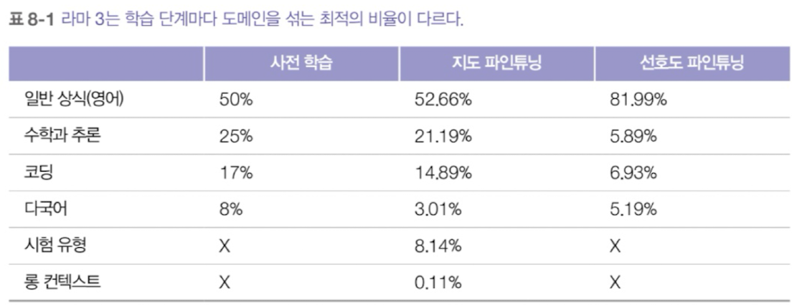
    
    - 모델 아키텍처 면에서는 이전 라마 버전들과 크게 다르지 않다
    - 성능 향상은 주로 **데이터 품질과 다양성 개선, 늘어난 학습규모**에 의해 이뤄짐
    - 사전 학습, 지도 파인튜닝, 선호도 파인튜닝
    - 사후 학습의 경우, 표에 없는 토큰 수(컨텍스트, 응답 모두)와 턴 수 등을 고려해야한다.
    - 사전 학습과 지도 파인튜닝에서 수학, 추론, 코드 토큰을 모두 합치면 학습 데이터의 거의 절반인데, 이는 실제 인터넷 데이터에서의 비율보다 훨씬 많은 수치이다.
        - 고품질 코드와 수학 데이터가 자연어 텍스트보다 모델의 추론 능력을 키우는 데 더 효과적이라는 통념이 존재함
    - 실제 사용자 선호도의 분포를 반영하려는 선호도 파인튜닝에서 코드와 수학 데이터의 비중은 훨씬 적다(12.82%)
    - 올바른 데이터 조합 선정 방법
        - 실제 애플리케이션 사용 패턴을 맞춰 데이터 조합을 선택하는 것
        - 실험을 통해 최적의 데이터 조합을 찾음
    - 데이터 다양성과 품질이 미치는 영향
        
        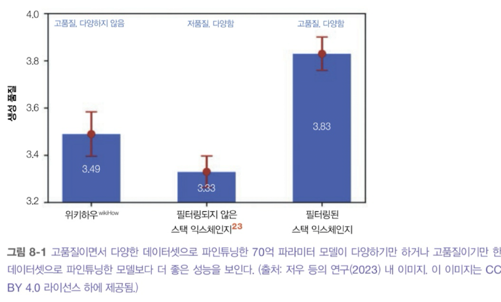
        
        - 크기는 같지만(2000개 sample), 특성이 다른 3개의 데이터셋으로 70억 파라미터 언어 모델을 학습시킴
        - 고품질의 다양성을 추구한 데이터가 가장 좋은 성능을 나타냄

### 8.1.3 데이터 양

- 얼마나 많은 데이터가 필요한지 == 얼마나 많은 돈이 필요한지

<aside>

수백만 개의 예시가 있따면, 그냥 처음부터 모델을 학습시키는 것이 더 좋은 게아닌가?

사전 학습 모델 위에 파인튜닝하는 것이 처음부터 학습시키는 것보다 효율적이지만 오히려 더 나쁠 수 있는 상황도 있다. (특히, 학습 데이터가 많을 때) → 경화(Ossification)

사전 학습이 모델 가중치를 경화시켜서(얼려서) 파인튜닝 데이터에 잘 적응하지 못하게 만들 수 있다.

</aside>

- 필요한 데이터의 양을 결정하는 요소
    - 파인튜닝 기법
        - 전체 파인튜닝은 최고 성능을 낼 수 있지만, LoRA 같은 PEFT 방법보다 많은 데이터가 필요하다.
        - (지시, 응답) 쌍이 수만개에서 수백만 개 있다면 Full 파인튜닝, 수백 개에서 수천 개 정도밖에 없다면 PEFT가 가장 효과적일 것이다.
    - 과제 복합성
        - 제품 리뷰의 긍부정을 판단하는 가제는 금융 서류 Q&A 작업보다 더 적은 데이터로 학습 가능하다.
    - 기본 모델의 성능
        - 기본 모델이 원하는 성능에 가까울수록 목표에 도달하는 데 필요한 예시가 적다.
            
            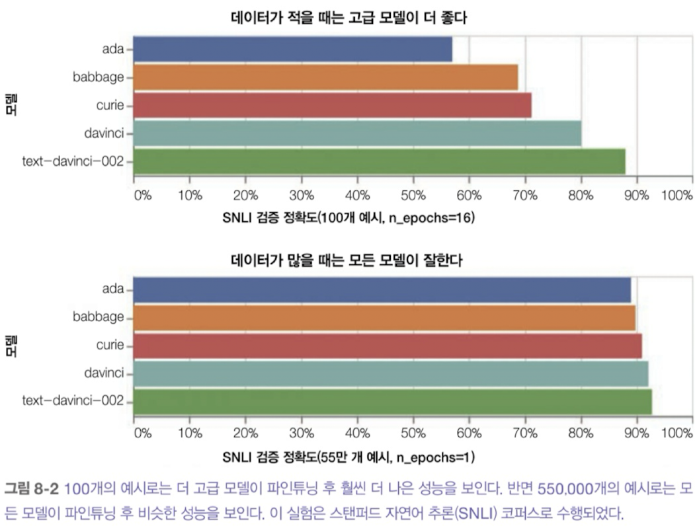
            
    - 데이터가 적으면 더 고급 모델에 PEFT 방법을 사용
    - 대규모 데이터셋 구축에 투자하기 전,
        - 잘 만들어진 소규모 데이터셋으로 파인튜닝이 모델을 개선할 수 있는지 확인해 본다.
            - 개선할 수 있다면, 데이터를 더 추가하면 성능이 향상될 가능성이 높다는 신호
            - 개선할 수 없다면, 데이터를 아무리 늘려도 큰 효과를 기대하기 어려움
        - 성급한 판단은 위험하다.
            - 하이퍼파라미터 선택, 데이터 품질, 프롬프트 작성 방식 등이 모두 영향을 미친다.
                
                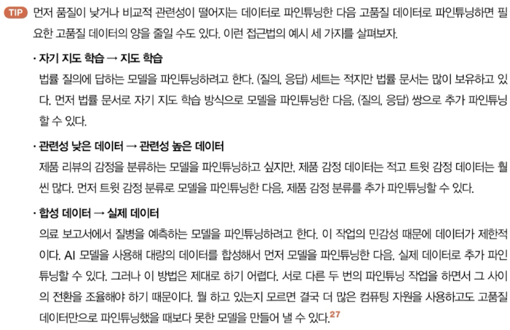
                
            - 데이터셋 크기별 성능 증가 곡선 기반 학습 예시의 모델 성능 영향 판단
                
                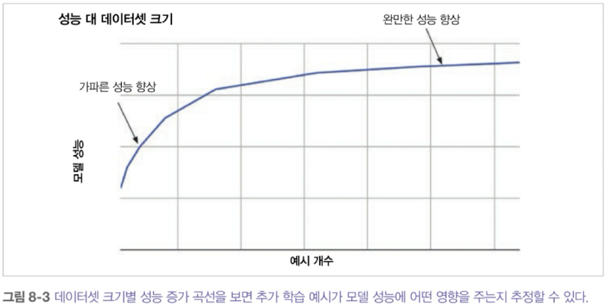
                
            - 파인튜닝의 다양성에 따른 모델 성능 비교
                
                
                

### 8.1.4 데이터 수집과 주석

- 공개 데이터 수집, 독점 데이터, 구매, 데이터 주석 작업, 데이터 합성 등 데이터 수집 방법은 많지만,
그 중에서 **가장 중요한 데이터 소스는 자체 애플리케이션에서 나오는 데이터다.**
    - 사용자가 생성한 데이터를 통해 제품을 지속적으로 개선하는 데이터 플라이휠을 구축
    - **(지시, 응답) 데이터셋 생성 과정**
        
        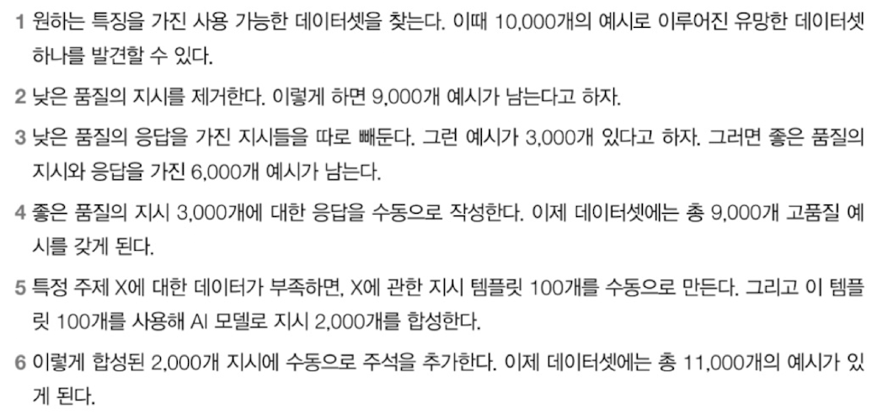
        
        - 이는 단순화한 것이고, 실제로는 다시 주석을 달거나, 주석을 다는 사람을 추가로 고용하거나 할 수 있다.
    - 공개 데이터셋 리소스
        - 허깅페이스, 캐글
        - 구글의 Dataset Search
        - 미시간 대학교 사회연구소 ICPSR의 사회과학 연구 데이터
        - UC 어바인의 ML 저장소와 OpenML
        - Open Data Network
        - AWS의 Open Data
        - 텐서플로 데이터셋
        - Eleuther AI의 lm-evaluation-harness
        - Stanford Large Network Dataset Collection
    - 주석을 달기 위해 명확한 가이드라인이 필요하다.
        
        (평가 가이드라인과 데이터 큐레이션에 많은 시간을 투자해야한다.)
        
        주석 가이드라인이 AI 엔지니어링 파이프라인에서 가장 까다로운 부분 중 하나인 이유
        
    

## 8.2 데이터 증강 및 합성

- 데이터 증강(Data augmentation)
    - 기존 데이터(실제 데이터)에서 새로운 데이터를 만든다.
- 데이터 합성(Data synthesis)
    - 실제 데이터의 특성을 모방하는 데이터를 생성한다.(실제 데이터에서  나오는 것 아님)

### 8.2.1 데이터 합성을 하는 이유

- 데이터 양 늘리기
    - 대규모로 데이터를 만들 수 있어서 AI 모델 학습과 테스트에 풍부한 데이터를 공급
- 데이터 커버리지 늘리기
    - 특정 특성을 가진 데이터를 생성해서 모델 성능을 개선하거나 모델이 특정 행동을 하도록 만듦
- 데이터 품질 향상
    - 보통은 합성 데이터가 사람이 만든 데이터보다 품질이 떨어진다고 생각하지만, 때로는 그 반대일 수 있따.
- 프라이버시 문제 해결
    - 프라이버시 문제로 인해 사람이 생성한 데이터를 사용할 수 ㅇ벗는 경우에는 합성 데이터가 유일한 선택지인 경우가 많다.
- 모델 종류
    - 때로는 다른 모델의 행동을 모방하는 모델을 학습시키고 싶을 수 있다. 목표는 원래 모델과 비슷한 성능을 내면서도 더 저렴하거나 빠른 모델(증류된 모델)을 만드는 것이다. 이는 원래 모델이 생성한 데이터로 증류된 모델을 학습시키는 방식으로 이뤄진다.

### 8.2.2 전통적인 데이터 생성 기법

- 절차적 생성(Procedural generation)
    - AI, 게임, 소프트웨어 테스팅, 로보틱스 분야에서 알고리즘으로 데이터를 생성하는 방법
    - 규칙 기반 생성
        - 미리 정해둔 규칙과 템플릿을 사용하는 것
            
            
            
        - 데이터 편향을 줄이는 데 효과적이다.
        - 섭동(pertutbation): 기존 데이터에 노이즈를 넣어서 새로운 데이터를 생성, 학습에도 활용될 수 있다.
            - cf) CIFAR-10 테스트 데이터셋의 자연 이미지 중 67.9%와 ImageNet 중 16.04%가 픽셀 하나만 바꿔도 잘못 분류될 수 있다.
    - 시뮬레이션
        - 실제 세계에서 실험을 통해 데이터를 모으는 것은 비용도 많이 들고 위험할 수도 있어서, 이런 실험들을 가상으로 시뮬레이션할 수 있다.
            
            ex) 자율 주행, 로보틱스용 학습 데이터
            
        - 모델에게 도구 사용법을 가르치는 데이터를 생성하는 데도 많이 쓰인다.
        - 현실에서 일어나기 힘든 사건의 데이터를 생성하는 데 유용하다.
            - ex) 금융 분야에서 회사의 성공적인 상장, 파산 등의 시나리오를 시뮬레이션 하여 시장에 미치는 영향을 파악한다.
            - ex) 제조업체들은 재료나 부품의 결함을 시뮬레이션하여 이상 탐지나 품질 관리 모델을 학습시킬 데이터를 생성할 수 있다.

### 8.2.3 AI 기반 데이터 합성

- AI는 사람의 행동도 시뮬레이션할 수 있다.
    - ex) 체스 게임에서의 셀프플레이
    - ex) 일반적인 에이전트: AI 들끼리 서로 다른 전략으로 협상하게 하기
- 기존 데이터셋을 늘리기
    - ex) 기존 질의를 바탕으로 새로운 질의 만들기
- 프로그래밍 언어 번역
    - 역번역을 활용하여 코드 설명과 문서를 생성
- 사전 학습, 사후 학습 데이터 생성
    - 사후 학습에 좀 더 많이 쓰임, 지시 데이터와 선호도 데이터를 포함한 사후 학습 데이터가 보통 만들기 가장 힘들기 때문

### 지시 데이터 합성

- 각 예시에 지시와 응답이 포함된다. (지시와 응답을 만드는 것은 AI, 사람 둘 다 가능)
    - 지시 생성: 활용 사례를 충분히 다루는 지시 생성
    - 응답 생성: 지시 하나 당 하나 또는 여러 개의 응답을 생성
- 역지시 방법(Reverse instruction)
    - 스토리, 책, 위키백과 글 같은 기존의 긴 고품질 콘텐츠를 가져와서 AI로 그런 콘텐츠를 유도할 수 있는 프롬프트를 생성 → AI가 생성한 환각을 피하면서 더 고품질의 지시 데이터를 얻을 수 있다.
        
        <aside>
        
        1. 소수의 초기 예시로 시작해서 약한 모델을 학습시키낟.
        2. 이 약한 모델로 기존 고품질 콘텐츠에 대한 지시를 생성해서 고품질 지시 데이터를 만든다.
        3. 이 새로운 고품질 지시 데이터로 약한 모델을 파인튜닝한다.
        4. 원하는 성능에 도달할 때 까지 반복한다.
        </aside>
        
    - 합성 데이터를 사용해서 더 긴 컨텍스트를 이해하도록 모델을 파인튜닝
        - ex) 최대 8K 토큰을 처리하는데 128K 토큰을 처리
            - 긴 문서를 짧은 덩어리로 나눈다(ex: 8K 토큰 미만)
            - 짧은 덩어리마다 여러 (질의, 응답) 쌍을 생성한다.
            - (질의, 응답) 쌍마다 원래 긴 문서를 컨텍스트로 사용한다. 이 문서는 8K를 초과할 수 있지만 목표 길이보다는 짧다. 이렇게 하면 모델이 확장된 컨텍스트를 사용해서 질의에 답하도록 학습된다.
    - 코딩 지시 데이터 합성
        
        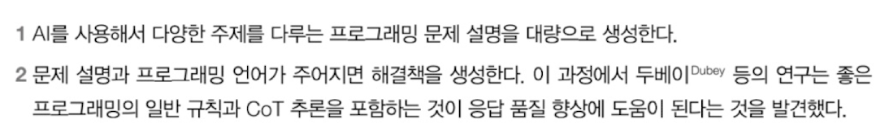
        
        - 그 후, 엄경한 정확성 분석과 오류 수정 과정
            
            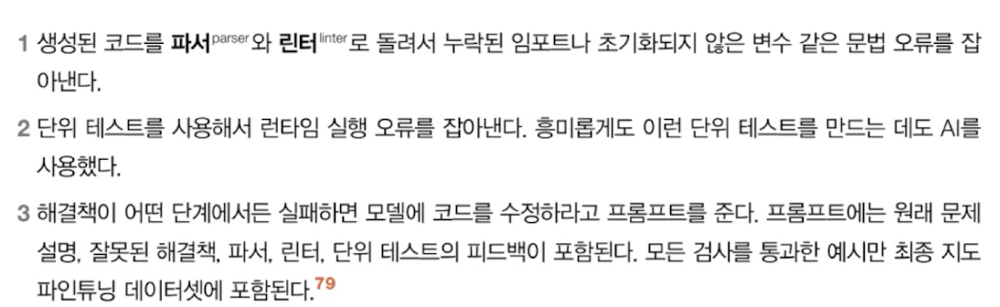
            
        - 코드 번역, 코드 역번역, 코드 생성을 함께 작동
            
            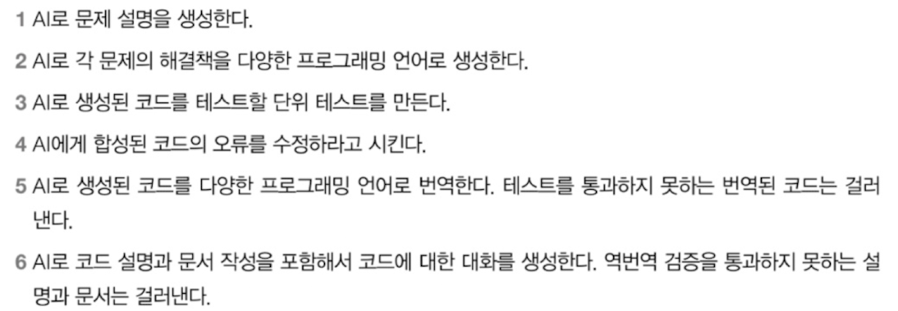
            

### 데이터 검증

- AI 검증기(AI verifier), 휴리스틱 등의 방법이 생겼지만, 평가는 여전히 어렵다.

### AI 생성 데이터의 한계(사람을 완전히 대체할 수 없는 이유)

- 품질의 차이: Garbage in, Garbage out
- 파상적 모방의 한계: 모방을 통해 얻은 성능은 겉보기에만 좋아 보일 수 있다.(사실적 정확성과 학습데이터 범위를 벗어난 과제에 대한 일반화에는 어려움을 겪음)
- 모델 성능 저하 가능성: AI가 생성한 데이터를 반복적으로 학습에 사용되면 돌이킬 수 없는 모델의 결함이 발생(모델 붕괴: model collapse)
- 데이터 계보의 불분명성: AI 모델은 학습 데이터의 영향을 받고, 그 내용을 출력할 수 있는데 이러한 점에서 데이터 계보가 불분명해진다. (벤치마크로 학습된 경우, 저작권 위반한 데이터로 학습된 모델의 경우)

### 8.2.4 모델 증류(Model distillation) - [지식 증류(knowledge distillation)]

- 작은 모델(학생)이 큰 모델(교사)을 모방하도록 학습시키는 방법
- 합성 지시 데이터는 LoRA 같은 어댑터 기반 기법과 함께 사용된다.
- 합성 데이터로 학습한다고 해서 모두 모델 증류인 것은 아니다. (모델 증류는 교사의 성능이 학생의 목표가 된다는 것인데, 합성 데이터를 사용해서 교사보다 더 크고 강력한 학생 모델을 학습시키는 것도 가능하다)

## 8.3 데이터 처리

### 8.3.1 데이터 검사

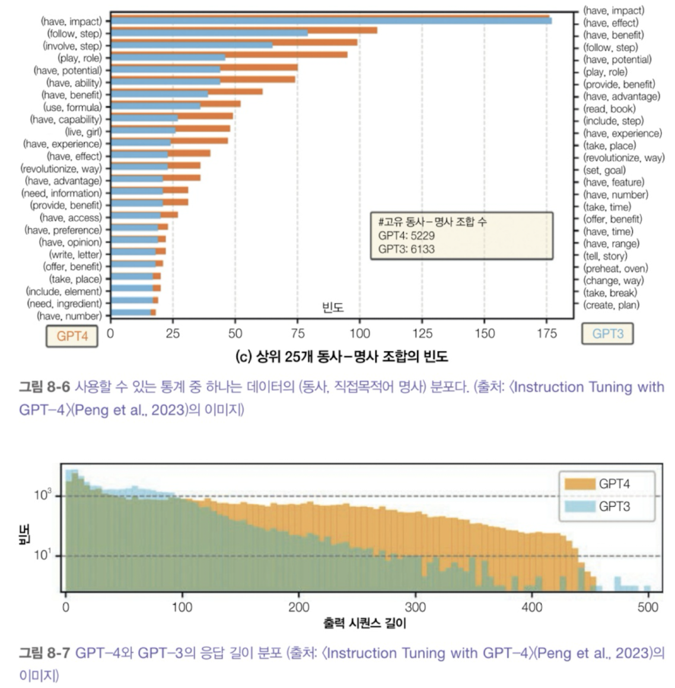

- 데이터의 기본 정보와 통계
- 토큰 분포, 입력 길이, 응답 길이
- (동사, 직접목적어, 명사) 쌍의 분포, (동사, 명사) 조합
- 데이터 출처, 시간, 주석자, 패턴, 이상값

### 8.3.2 데이터 중복 제거

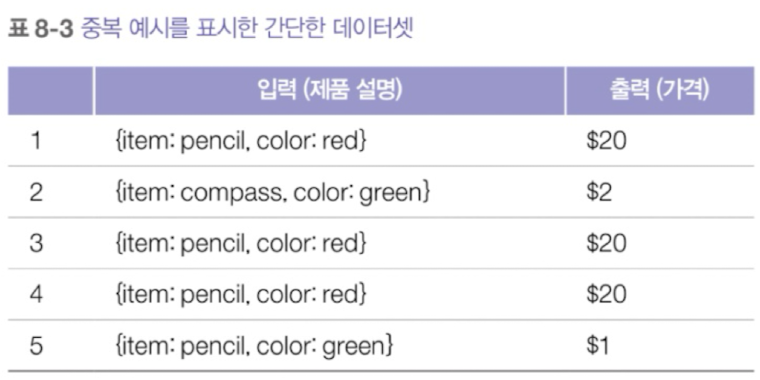

<aside>

중복된 항목으로 내린 잘못된 결론: 빨간색 물건은 모두 비싸야 한다

ex) **앤트로픽의 연구: 데이터의 0.1%를 100번 반복하면 나머지 90%의 학습 토큰이 고유해도 8억 파라미터 모델의 성능이 4억 파라미터 모델 수준으로 떨어질 수 있다.**

</aside>

- 중복의 형태는 다양하며 무엇을 중복으로 볼지도 정의에 다라 다르다.
- 중복 제거 작업은 유사성 측정 같은 기법을 활용하여 제거할 수 있다.
    - 쌍대 비교
    - 해싱
    - 차원 축소

### 8.3.3 데이터 정리 및 필터링

- 모델을 성능 좋고 안전하게 만들려면 데이터를 정리해야 한다.
    - HTML 태그, PII, 민감 데이터, 저작권 데이터, 유해 데이터, 저품질 데이터
- 휴리스틱으로 정리하는 것은 명확하지 않을 수 있다.
    
    → 능동 학습, 중요도 샘플링을 통해 좋은 데이터에 대해 정리할 수 있다.
    

### 8.3.4 데이터 형식 맞추기

- 모델은 특정 토크나이저를 사용하고 특정 채팅 템플릿 형식의 데이터를 기대한다
    
    → 데이터를 잘못된 채팅 탬플릿으로 만들면 모델에 이상한 버그가 생길 수 있다.
    
    <aside>
    
    ex) 기본 모델에 음식 분류 과제를 위해 3-샷 지시를 사용한 경우
    
    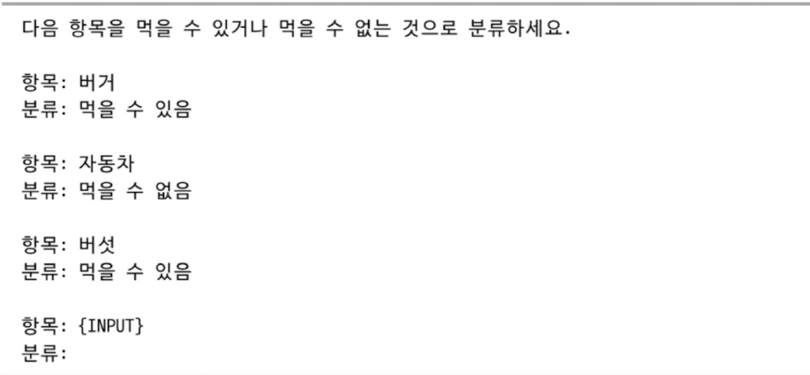
    
    파인튜닝 시 3-샷 프롬프트에 포함된 모든 예시를 학습 예시로 바꿀 수 있다.
    
    
    
    모델을 파인튜닝하고 나면 간단한 프롬프트를 쓸 수 있다.
    
    > {INPUT} -->
    > 
    
    이는 기본 모델에 쓰던 프롬프트보다 훨씬 짧고(파인튜닝이 비용을 통해 비용 절검 가능)
    
    파인튜닝 데이터 형식이 다르면 파인튜닝된 모델의 성능에 영향을 줄 수 있다.(실험해 보는 것을 추천)
    
    파인튜닝된 모델을 사용할 때는 프롬프트가 파인튜닝 데이터 형식과 일치하는지 확인
    
    “버거 -->” 형식의 프롬프트를 사용한다면 “버거”, “항목:버거 -->”, “버거 -->   “ 등의 프롬프트들은 문제를 일으킬 수 있다.
    
    </aside>